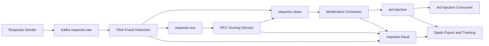

<!-- prettier-ignore -->
<div align="center">

# Adstract Request Safety Pipeline

**Kafka/Flink/Spark subsystem for fraud detection, moderation, and safe sponsored suggestion delivery in Adstract AI.**

[](https://www.python.org/)
[](https://kafka.apache.org/)
[](https://flink.apache.org/)
[](https://spark.apache.org/)
[](https://www.docker.com/)
[](https://iammistake.github.io/ai-ad-request-safety-pipeline/)

[Adstract](https://adstract.ai/) | [Project page](https://iammistake.github.io/ai-ad-request-safety-pipeline/) | [Architecture](#architecture) | [Getting started](#getting-started) | [Run locally](#run-locally)

</div>

Adstract is a B2B infrastructure layer for context-aware sponsored suggestions in conversational AI. Its product principle is simple: monetization should be clearly labeled, relevant to the user context, and controlled by the publisher. Learn more at [adstract.ai](https://adstract.ai/).

This repository implements the request-safety subsystem behind that principle. It simulates AI ad-request traffic, routes it through Kafka, applies real-time fraud scoring in Flink, checks approved prompts with a moderation layer, forwards safe requests to ad injection, and exports history for Spark analytics and model training.

> [!NOTE]
> This is a real Adstract subsystem developed in a university `Massive Data Mining` context.

## Features

- **Streaming request safety** with Kafka topics separating raw, suspicious, clean, blocked, and ad-ready events.
- **Real-time fraud detection** with PyFlink stateful rules for IP bursts, session behavior, publisher behavior, prompt replay, suspicious user agents, ASN risk, and language/country mismatch.
- **RFC model scoring** for suspicious requests before they are either cleared for moderation or blocked.
- **Moderation gate** with local rule-based mode and optional OpenAI Moderation API support.
- **Publisher-safe ad path** where only fraud-clean and moderation-clean requests reach `ad.injection`.
- **Historical analytics** with Spark rollups for IP, publisher, ASN, and session risk signals.
- **Offline ML training** with a Random Forest fraud model written to `spark_service/output/`.
- **Realistic request simulation** using WildChat prompt traffic, stable synthetic IPs, and offline fraud labels.

## Architecture



| Stage | What it does | Main file |
| --- | --- | --- |
| Requests sender | Replays labeled request events to Kafka | `kafka/producers/requests_sender.py` |
| Kafka infra | Runs local Kafka, Zookeeper, and Kafka UI | `docker-compose.yml` |
| Flink fraud detection | Scores and routes requests as clean, suspicious, or fraud | `flink_service/fraud_detection.py` |
| RFC scoring | Model-backed scoring for suspicious requests | `scoring_service/` |
| Moderation | Checks fraud-clean prompts before monetization | `moderation_service/moderation_consumer.py` |
| Ad injection | Consumes and prints approved request IDs | `pipeline_consumers/ad_injection_consumer.py` |
| Historical export | Exports Kafka history for batch processing | `spark_service/historical_exporter.py` |
| Spark training | Produces risk rollups and a local fraud model | `spark_service/spark_training.py` |

## Performance

| Service | Throughput | Precision |
| --- | --- | --- |
| Kafka | 13k+ req/s | — |
| Flink Fraud Detection | 3000–4000 req/s | 75%+ |
| RFC Scoring Service | 5–7k req/s | 95%+ |
| Moderation | 7k req/s | 99%+ |

> [!IMPORTANT]
> `requests.fraud` is the blocked-event stream for fraud and unsafe request outcomes. Clean requests continue toward `ad.injection` after moderation approval.

## Kafka Topics

| Topic | Purpose |
| --- | --- |
| `requests.raw` | Raw request ingress from the simulator |
| `requests.clean` | Fraud-clean requests ready for moderation |
| `requests.sus` | Suspicious requests waiting for RFC model scoring |
| `requests.fraud` | Blocked fraud and unsafe request outcomes |
| `ad.injection` | Fully approved requests ready for sponsored suggestion selection |

## Getting Started

### Prerequisites

- Python 3.10+
- Docker and Docker Compose
- Kafka available locally through `docker-compose.yml`
- Optional OpenAI API key for provider-backed moderation

> [!TIP]
> Kafka UI is exposed at `http://localhost:8080` after Docker Compose starts.

### Install dependencies

```bash
pip install -r requirements.txt
```

### Start local infrastructure

```bash
docker-compose up -d
```

### Configure moderation

```bash
cp .env.example .env
```

Default moderation uses `MODERATION_PROVIDER=mock`. To call OpenAI Moderation, set `MODERATION_PROVIDER=openai` and provide `OPENAI_API_KEY`.

### Prepare simulator data

Download WildChat locally, then build labeled replay splits:

```bash
python scripts/download_wildchat.py
```

```bash
python scripts/build_labeled_requests_dataset.py
```

The simulator replays `datasets/labeled_requests/train.jsonl` by default and
publishes only each row's `event` payload to Kafka.

## Run Locally

Run long-lived services in separate terminals.

### 1. Watch Kafka topics

```bash
python test_consumer.py
```

### 2. Start fraud detection

```bash
python flink_service/fraud_detection.py
```

### 3. Start moderation

```bash
python moderation_service/moderation_consumer.py
```

### 4. Start ad injection

```bash
python pipeline_consumers/ad_injection_consumer.py
```

### 5. Publish simulated requests

```bash
python kafka/producers/requests_sender.py
```

Replay a different split with:

```bash
python kafka/producers/requests_sender.py --input datasets/labeled_requests/test.jsonl
```

### 6. Start all services with tmux (auto)

Launch every pipeline service in a single command with tmux:

```bash
bash scripts/start_pipeline_tmux.sh
```

This creates a `pipeline` tmux session with 6 windows:

| Window | Service |
| --- | --- |
| `docker-and-topics-setup` | Starts Docker infra and creates all Kafka topics |
| `flink` | Python Flink fraud detection job (waits 40 s for topics) |
| `rfc` | RFC model scoring service |
| `moderation` | Moderation consumer |
| `ad-injection` | Ad injection consumer |
| `sender` | Labeled request simulator |

The script uses the `adstract-django` conda environment and requires Docker to be available. Run `docker-compose up -d` first if Docker is not already running.

> [!WARNING]
> `flink_service/fraud_detection.py` expects the Kafka connector JARs in the repository root. If those filenames change or the files are removed, update the JAR references in the Flink job.

## Smoke Checks

The repository includes manual flow checks:

```bash
./scripts/test_full_pipeline.sh
./scripts/test_fraud_block_flow.sh
./scripts/test_moderation_block_flow.sh
```

These scripts validate pipeline behavior locally; they are not a formal CI test suite.

## Spark Analytics

Export Kafka history into the Spark input path:

```bash
python spark_service/historical_exporter.py --from-beginning --idle-seconds 30
```

Run risk rollups and model training:

```bash
python spark_service/spark_training.py
```

Spark reads `spark_service/data/request_logs.json` by default and writes outputs under `spark_service/output/`.

## Resources

- [Adstract](https://adstract.ai/)
- [Project page](https://iammistake.github.io/ai-ad-request-safety-pipeline/)
- [Apache Kafka](https://kafka.apache.org/)
- [Apache Flink](https://flink.apache.org/)
- [Apache Spark](https://spark.apache.org/)
- [WildChat dataset](https://huggingface.co/datasets/allenai/WildChat)
- [OpenAI Moderation API](https://platform.openai.com/docs/guides/moderation)
