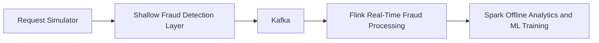

# Current Architecture

## Architectural Goal

The project models a real-time fraud detection platform for AI advertising
requests. It is designed around a low-latency path for immediate filtering and
a batch path for deeper historical analysis.

## Preserved Architecture

This flow is the architectural baseline for the project and should remain the
reference point for future implementation work.

## Why This Shape Fits The Problem

| Layer | Why it exists |
| --- | --- |
| Request Simulator | Produces synthetic traffic for development, demos, and evaluation |
| Shallow Fraud Detection | Rejects obviously suspicious traffic with minimal latency |
| Kafka | Decouples producers from processors and provides durable event streaming |
| Flink | Performs real-time rule evaluation and stream analytics |
| Spark | Aggregates historical data and trains stronger fraud models |

## Component Responsibilities

| Component | Main responsibility | Current location |
| --- | --- | --- |
| Request Simulator | Build request events and publish them | `kafka/producers/request_simulator.py` |
| Shallow Fraud Detection Layer | Use Redis counters and simple rules for fast screening | `shallow_fraud_detection/shallow_fraud_detector.py` |
| Kafka Broker | Buffer, partition, and distribute events | `docker-compose.yml` |
| Debug Consumer | Inspect messages during local development | `test_consumer.py` |
| Flink Fraud Processor | Apply real-time fraud rules over streamed requests | `flink_service/fraud_detection.py` |
| Spark Analytics | Train models and aggregate long-term risk signals | `spark_service/spark_training.py` |

## Current Architectural Reading

There are two important perspectives to keep in mind:

1. Intended architecture
   The repository documents a broader multi-stage ad fraud and moderation
   platform.
2. Current prototype implementation
   The code currently contains the first working pieces of that larger design.

Both perspectives are valid and should be documented together rather than being
treated as conflicting.

## Planned Extended Flow

The top-level README already names additional topics associated with the wider
system direction:

- `fraud.verdicts`
- `moderation.verdicts`
- `ad.candidate`
- `ad.cancel`

Those topics represent the broader distributed decision pipeline around ad
approval, rejection, and moderation.

## Architectural Characteristics

### Event-driven

Requests move through the system as events rather than direct synchronous calls.

### Hybrid processing

Flink provides online decision support, while Spark provides offline learning
and historical aggregation.

### Layered fraud defense

The design intentionally separates:

- shallow rules for immediate filtering
- stream-time rules for contextual real-time detection
- offline analytics for richer fraud intelligence

### Incremental evolution

The current implementation direction suggests that new logic should be added by
extending the existing layers instead of replacing them.

## Current Architecture Notes

| Area | Current prototype note |
| --- | --- |
| Shallow fraud layer | Prototype detector and Kafka forwarder exist with Redis-backed shallow rules |
| Kafka usage | Present in documentation and local tooling; topic contracts are still being aligned |
| Flink processing | Most advanced runtime component in the repository |
| Spark training | Initial offline training pipeline is present |
| Moderation service | Planned service, not yet implemented |

## Future Agents Guidance

When extending the project, prefer these moves:

- wire existing stages together more completely
- standardize request schemas across producer and processors
- expand detection logic inside Redis, Flink, and Spark layers
- add missing planned services without changing the architecture shape
