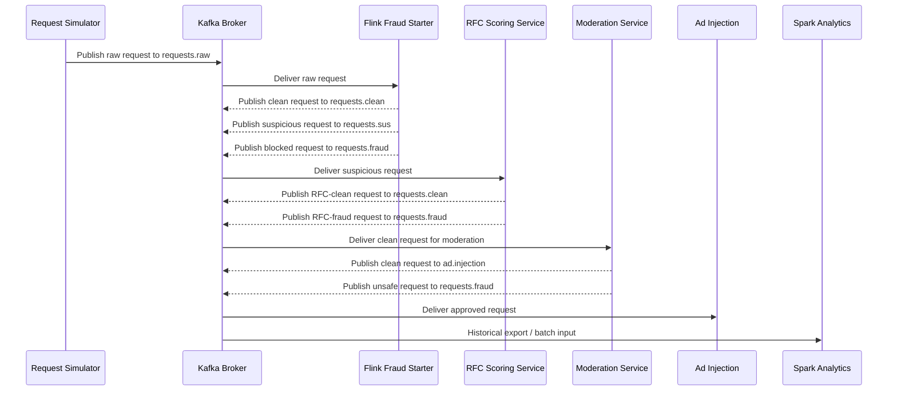

# Current Architecture

## Architectural Goal

The project models a real-time fraud detection and moderation platform for AI
advertising requests. It is designed around a sequential streaming path and a
batch path for deeper historical analysis.

## Target Architecture

## Primary Event Flow

## Topic Boundaries

| Topic | Context |
| --- | --- |
| `requests.raw` | Raw ingress topic for simulator output |
| `requests.sus` | Suspicious requests waiting for RFC scoring |
| `requests.clean` | Fraud-clean requests waiting for moderation |
| `requests.fraud` | Blocked fraud or unsafe requests |
| `ad.injection` | Fully approved requests for ad injection |

## Why This Shape Fits The Problem

| Layer | Why it exists |
| --- | --- |
| Request Simulator | Produces synthetic traffic for development, demos, and evaluation |
| Kafka | Decouples producers from processors and provides durable event streaming |
| Flink | Performs low-latency fraud evaluation and request gating |
| RFC Scoring Service | Uses the Spark-trained model to score suspicious requests |
| Moderation Service | Performs external moderation checks before monetization |
| Spark | Aggregates historical data and trains stronger fraud models |

## Component Responsibilities

| Component | Main responsibility | Current location |
| --- | --- | --- |
| Request Simulator | Build request events and publish them | `kafka/producers/request_simulator.py` |
| Kafka Broker | Buffer, partition, and distribute events | `docker-compose.yml` |
| Debug Consumer | Inspect messages during local development | `test_consumer.py` |
| Flink Fraud Starter | Current clean-by-default stream gate; rules will be added one by one | `flink_service/fraud_detection.py` |
| RFC Scoring Service | Score suspicious requests with the offline-trained model | Planned in `scoring_service/` |
| Moderation Service | Call the moderation provider and forward approved requests | `pipeline_consumers/moderation_consumer.py` |
| Ad Injection Consumer | Consume fully approved requests | `pipeline_consumers/ad_injection_consumer.py` |
| Spark Analytics | Not planned in detail yet | `spark_service/spark_training.py` |

## Architectural Characteristics

### Event-driven

Requests move through the system as Kafka events rather than direct synchronous calls.

### Sequential gating

The design intentionally separates:

- raw ingress
- real-time fraud gating
- model scoring for suspicious requests
- moderation gating
- historical learning

### Hybrid processing

Flink provides online decision support, while Spark provides offline learning
and historical aggregation.

## Current Architecture Notes

| Area | Current prototype note |
| --- | --- |
| Kafka usage | Target active topics are `requests.raw`, `requests.sus`, `requests.clean`, `requests.fraud`, and `ad.injection` |
| Flink processing | Reset to a small starter fraud gate for incremental cleanup |
| RFC scoring service | Planned service for model-based suspicious request scoring |
| Moderation service | Prototype exists with `.env` configuration and OpenAI-ready provider support |
| Spark training | Existing prototype is parked until a new plan is written |

## Future Agents Guidance

When extending the project, prefer these moves:

- wire existing stages together more completely
- standardize request schemas across producer and processors
- expand detection logic inside Flink, moderation, and Spark layers
- add missing planned services without changing the architecture shape
