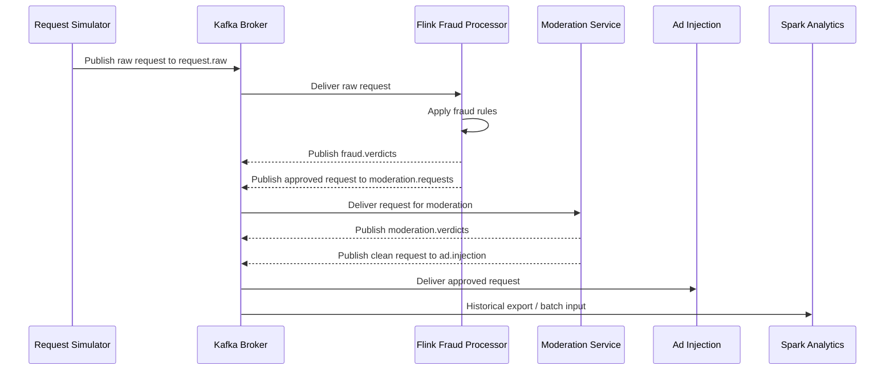

# Event Flow

## Primary Request Lifecycle

## Stage-by-Stage Description

1. Request creation
   The simulator creates synthetic request events with identifiers, prompt text, metadata, and session information.
2. Kafka ingestion
   Raw requests are published to `request.raw`.
3. Fraud processing
   Flink applies the former shallow checks and the richer stream-time rules inside one keyed fraud stage.
4. Moderation processing
   Clean requests, and suspicious requests when enabled by one Flink constant, are forwarded to moderation.
5. Ad injection
   Only moderation-clean requests reach `ad.injection`.
6. Historical analytics and training
   Spark consumes historical logs built from Kafka topics.

## Current Topic Boundaries

| Topic | Context |
| --- | --- |
| `request.raw` | Raw ingress topic for simulator output |
| `moderation.requests` | Fraud-approved requests waiting for moderation |
| `ad.injection` | Fully approved requests for ad injection |
| `fraud.verdicts` | Fraud verdicts and session summaries |
| `moderation.verdicts` | Moderation verdicts |
