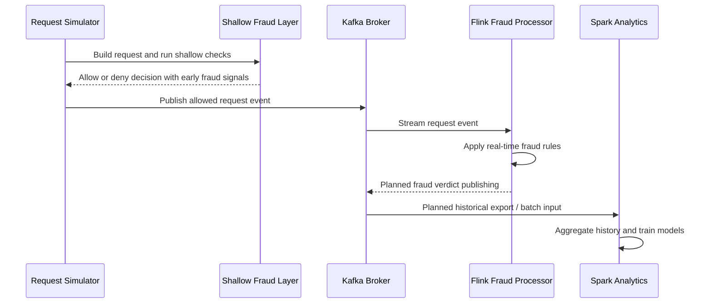

# Event Flow

## Goal

This document explains how a single ad request is expected to move through the
system and how the current prototype maps onto that lifecycle.

## Primary Request Lifecycle

## Stage-by-Stage Description

### 1. Request creation

The simulator is expected to create realistic synthetic request events that
represent AI monetization requests. These events should include identifiers,
prompt text, metadata, and client or session information.

### 2. Shallow fraud screen

The first decision layer is designed to run fast checks against Redis-backed
counters and a small rule set. The purpose is to stop obviously suspicious
traffic before it enters the deeper streaming path.

Typical signals at this layer:

- request bursts from the same IP
- repeated user-agent patterns
- repeated session activity
- known scam keywords
- proxy or VPN indicators

### 3. Kafka ingestion

Requests that pass the shallow layer are published to Kafka. Kafka provides the
stream backbone for downstream processors.

### 4. Parallel downstream processing

Allowed requests are currently fanned out through a shared Kafka topic so
multiple downstream consumers can process the same request concurrently. A
separate cancel topic allows one downstream worker to interrupt the others while
they are still processing.

### 5. Historical analytics and training

Spark processes accumulated request logs to extract longer-term risk patterns
and to train an offline fraud model.

## Current Prototype Flow

The current codebase represents an initial version of the lifecycle above:

| Stage | Current status |
| --- | --- |
| Simulator | Streams WildChat Arrow rows with GeoLite2-enriched geo context |
| Shallow fraud layer | Redis-backed detector scaffold exists |
| Kafka transport | Local infrastructure is present in Docker Compose |
| Parallel downstream consumers | Ad injection, placeholder fraud, and placeholder moderation workers run in parallel on the same topic |
| Flink processor | Separate real-time logic is still implemented as a prototype |
| Spark analytics | Current offline training logic is implemented as a prototype |

## Current Event Boundaries

The repository currently references more than one topic naming path.

| Topic | Context |
| --- | --- |
| `shallow-fraud-detection` | Referenced by simulator scaffold and debug consumer |
| `ad.injection` | Current shallow-approved fan-out topic for three downstream consumers |
| `ad.cancel` | Current downstream interrupt topic for in-flight work |
| `ad.request_raw` | Used by the Flink streaming job |

This should be read as an implementation alignment task rather than an
architectural change request.

## Event Schema Direction

The current code produces a request structure with these top-level fields:

- `req_id` — random request identity
- `prompt` — user prompt text from WildChat
- `language` — conversation language
- `request_context.session_id` — session identity
- `request_context.user_ip` — client IP
- `request_context.user_agent` — client user-agent
- `request_configuration.wrapping_type` — wrapping format (`json`/`txt`/`xml`)
- `optional_context.country` — geo country
- `optional_context.region` — geo region
- `optional_context.city` — geo city
- `optional_context.asn` — network-level signal
- `publisher_id` — traffic source identity

The current downstream placeholder consumers also recognize an optional
`control` block for local testing:

- `control.cancel_by` — one of `ad-injection`, `fraud-detection`, or `moderation-detection`
- `control.cancel_at_percent` — percent progress at which that consumer emits `ad.cancel`
- `control.cancel_reason` — free-text reason included in the cancel message

These fields form the current schema contract between ingestion, stream
processing, and analytics.

## Future Event Flow Extensions

Planned flow extensions already implied by the repository documents include:

- publishing fraud verdict events
- adding moderation verdict events
- joining fraud and moderation results in a coordinator stage
- exporting finalized historical logs for Spark retraining

## Design Principle

The system should keep a clear separation between:

- low-latency rejection
- stream-time evaluation
- historical learning

That separation is one of the core reasons the architecture is useful for a
fraud detection problem in AI advertising.
