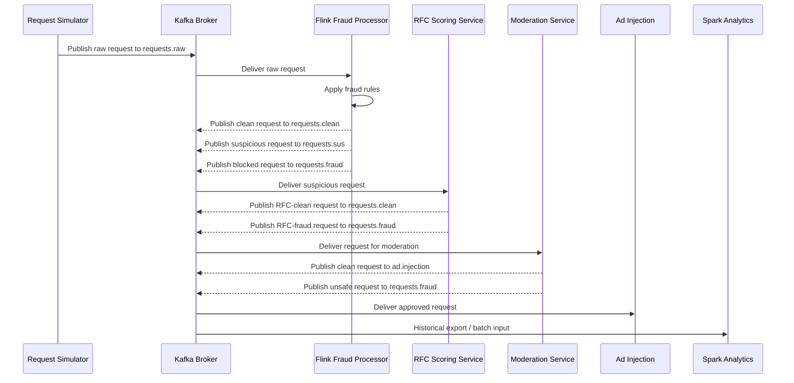

# Event Flow

## Primary Request Lifecycle

## Stage-by-Stage Description

1. Request creation
   The simulator creates synthetic request events with identifiers, prompt text, metadata, and session information.
2. Kafka ingestion
   Raw requests are published to `requests.raw`.
3. Fraud processing
   Flink applies shallow stream-time rules and routes requests to `requests.clean`, `requests.sus`, or `requests.fraud`.
4. RFC scoring
   Suspicious requests are scored by the offline-trained model and routed to `requests.clean` or `requests.fraud`.
5. Moderation processing
   Fraud-clean requests are checked by moderation and routed to `ad.injection` or `requests.fraud`.
6. Ad injection
   Only moderation-clean requests reach `ad.injection`.
7. Historical analytics and training
   Spark consumes historical logs built from Kafka topics.

## Current Topic Boundaries

| Topic | Context |
| --- | --- |
| `requests.raw` | Raw ingress topic for simulator output |
| `requests.sus` | Suspicious requests waiting for RFC scoring |
| `requests.clean` | Fraud-clean requests waiting for moderation |
| `requests.fraud` | Blocked fraud or unsafe requests |
| `ad.injection` | Fully approved requests for ad injection |
