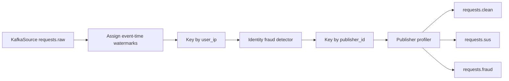

# Flink Processing

## Purpose

`flink_service/fraud_detection.py` is the current real-time fraud detection
service. It consumes raw request events from Kafka, assigns event-time
watermarks, applies identity keyed fraud rules with managed Flink state,
applies publisher keyed profiling, and routes requests to clean, suspicious, or
blocked topic boundaries.

## Current Entry Point

- File: `flink_service/fraud_detection.py`
- Kafka source topic: `requests.raw`
- Consumer group: `flink-fraud-consumer`

## Current Processing Pipeline



## Current Rule Set

| Rule | Description |
| --- | --- |
| IP request frequency | Flag repeated requests from the same IP identity |
| IP event-time burst | Flag more than 8 requests from one identity in 60 event-time seconds |
| Prompt similarity and repetition | Flag repeated normalized prompts in event-time windows and frequency maps |
| Rapid repeat timing | Flag same-IP rapid repeats with mobile/desktop thresholds |
| Suspicious or invalid UA | Score suspicious agents and malformed user agents |
| Language-country mismatch | Score mismatches between language and country |
| Session burst | Score repeated requests from one session |
| Geo churn | Track country distribution and recent country shifts per identity |

## Target Forwarding Rule

The target forwarding rule is:

```text
score < 0.5          -> requests.clean
0.5 <= score < 0.8   -> requests.sus
score >= 0.8         -> requests.fraud
```

Phase 4 of `docs/new_architecture_plan/` will complete the Flink routing and
rule cleanup.
