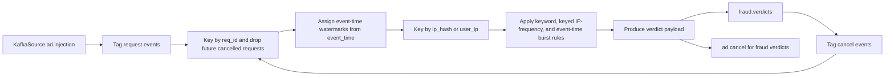

# Flink Processing

## Purpose

`flink_service/fraud_detection.py` is the current real-time fraud detection
service. It consumes shallow-approved request events plus cancel signals from
Kafka, ignores future requests whose `req_id` has already been cancelled,
assigns event-time watermarks from request payload timestamps, applies keyed
fraud rules plus an event-time burst check, emits verdicts, and can cancel
downstream work for hard fraud cases.

## Current Entry Point

- File: `flink_service/fraud_detection.py`
- Kafka source topics: `ad.injection`, `ad.cancel`
- Consumer group: `flink-fraud-consumer`

## Current Processing Pipeline

## Current Rule Set

| Rule | Description | Current source |
| --- | --- | --- |
| Scam prompt keywords | Flag requests containing known suspicious phrases | `SCAM_KEYWORDS` |
| IP request frequency | Flag repeated requests from the same IP identity | keyed Flink `ValueState` |
| IP event-time burst | Flag more than 8 requests from one identity in a 60-second event-time window | keyed Flink `ListState` + request timestamps |
| Shallow score escalation | Upgrade already-risky requests using shallow score | `shallow_fraud.fraud_score` |

## Current Implementation Notes

The current file performs the following steps:

1. Creates a `StreamExecutionEnvironment`.
2. Adds Kafka connector jars.
3. Configures a Kafka source for `ad.injection`.
4. Configures a Kafka source for `ad.cancel`.
5. Reads string events with `SimpleStringSchema`.
6. Keys the merged stream by `req_id` and stores cancel state.
7. Drops any later request event for a `req_id` that has already been cancelled.
8. Assigns bounded out-of-orderness watermarks from `event_time` after cancel suppression.
9. Keys surviving request events by `shallow_fraud.identities.ip_hash` with a `user_ip` fallback.
10. Applies keyed rule-based fraud logic with managed state.
11. Counts recent requests inside a 60-second event-time window per identity.
12. Publishes verdict events to `fraud.verdicts`.
13. Publishes `ad.cancel` for hard fraud verdicts.

## Current Fraud Signals In Code

The current service scores and classifies requests using:

- the prompt contains a scam keyword
- the keyed count for a specific IP identity exceeds `15`
- more than `8` requests arrive for the same identity inside the trailing `60` event-time seconds
- the shallow fraud score is already elevated enough to escalate risk

Current keyword list:

- `hack`
- `bitcoin`
- `generator`
- `credit card`
- `multiplier`
- `loan`
- `scam`
- `earn money fast`
- `click here`

## Current Output Shape

The job currently emits a JSON verdict payload with:

- `req_id`
- `event_time`
- `publisher_id`
- `prompt` preview
- `count_from_ip`
- `window_request_count`
- `window_size_seconds`
- `fraud_score`
- `reasons`
- `ip_hash`
- `shallow_fraud_score`
- `shallow_fraud_flags`
- `verdict`

## Streaming Concepts In Context

### Keyed streams

The current file keys the stream by `ip_hash` when present and falls back to
`user_ip` otherwise.

### Stateful stream processing

Fraud detection depends on remembering prior events. The current file uses
managed Flink `ValueState` with TTL for per-identity request counters.

### Event time and watermarking

The current job assigns bounded out-of-orderness watermarks from each request's
`event_time` after the cancel filter. The current default lateness allowance is
`5` seconds.

This phase adds the first event-time aware fraud signal while keeping the rest
of the service simple. The architecture still supports later adoption of:

- sliding windows
- tumbling windows

These concepts matter for rate spikes, burst analysis, and later session-level
fraud patterns.

## Recommended Future Enhancements Within The Same Direction

| Area | Direction |
| --- | --- |
| Stateful counters | Extend the current keyed state with session and publisher counters |
| Windows | Add tumbling and sliding windows for burst detection |
| Sinks | Add richer downstream sinks beyond `fraud.verdicts` and `ad.cancel` |
| Feature enrichment | Add ASN, device, region, and session signals |
| Score output | Emit fraud scores in addition to binary verdicts |

## CEP And Advanced Detection Ideas

The current architecture is compatible with future Complex Event Processing
without requiring redesign.

Possible CEP directions:

- burst of repeated prompts from one IP range
- many session identifiers switching under the same network identity
- rapid transition from normal prompts to obvious scam prompts
- coordinated publisher-side anomalies across time windows

## Geo And Session Analysis Ideas

Future Flink versions of this service can extend the same pipeline with:

- geo anomalies based on region changes or impossible travel patterns
- session chaining and repeated request-path analysis
- publisher-level abnormal request ratios
- prompt manipulation detection based on token patterns or repeated templates

## Current Prototype Boundary

This file is currently the canonical real-time fraud processor in the
repository and should be treated as the reference point for Flink-based fraud
processing work.
