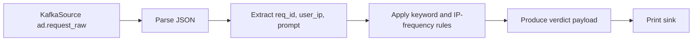

# Flink Processing

## Purpose

`flink_service/fraud_detection.py` is the current real-time fraud detection
prototype. It consumes request events from Kafka and applies lightweight stream
rules that are suitable for low-latency analysis.

## Current Entry Point

- File: `flink_service/fraud_detection.py`
- Kafka source topic: `ad.request_raw`
- Consumer group: `flink-consumer`

## Current Processing Pipeline

## Current Rule Set

| Rule | Description | Current source |
| --- | --- | --- |
| Scam prompt keywords | Flag requests containing known suspicious phrases | `SCAM_KEYWORDS` |
| IP request frequency | Flag repeated requests from the same IP | `ip_counter` |

## Current Implementation Notes

The current file performs the following steps:

1. Creates a `StreamExecutionEnvironment`.
2. Adds Kafka connector jars.
3. Configures a Kafka source for `ad.request_raw`.
4. Reads string events with `SimpleStringSchema`.
5. Parses JSON with `analyze_request`.
6. Extracts `request_context.user_ip`, `prompt`, and `req_id`.
7. Applies rule-based fraud logic.
8. Prints result events.

## Current Fraud Signals In Code

The prototype marks a request as fraud when either of the following is true:

- the prompt contains a scam keyword
- the in-memory count for a specific IP hash exceeds `15`

Current keyword list:

- `hack`
- `bitcoin`
- `generator`
- `credit card`
- `multiplier`
- `loan`
- `scam`
- `earn money fast`
- `click here`

## Current Output Shape

The job currently emits a JSON-like verdict payload with:

- `request_id`
- `ip`
- `prompt` preview
- `count_from_ip`
- `verdict`

## Streaming Concepts In Context

### Keyed streams

The current file uses a Python dictionary for IP counting. In the long-term
Flink direction, the same logic naturally maps to keyed streams by `ip_hash`.

### Stateful stream processing

Fraud detection depends on remembering prior events. The current in-memory
counter is a prototype form of state. A more advanced version can move that
state into native Flink managed state while preserving the same architecture.

### Event time and watermarking

The current job uses `WatermarkStrategy.no_watermarks()`. That keeps the first
prototype simple. The architecture still supports later adoption of:

- event-time processing
- watermarking
- sliding windows
- tumbling windows

These concepts matter for rate spikes, burst analysis, and session-level fraud
patterns.

## Recommended Future Enhancements Within The Same Direction

| Area | Direction |
| --- | --- |
| Stateful counters | Replace local dictionary state with keyed Flink state |
| Windows | Add tumbling and sliding windows for burst detection |
| Sinks | Publish to `fraud.verdicts` instead of print-only output |
| Feature enrichment | Add ASN, device, region, and session signals |
| Score output | Emit fraud scores in addition to binary verdicts |

## CEP And Advanced Detection Ideas

The current architecture is compatible with future Complex Event Processing
without requiring redesign.

Possible CEP directions:

- burst of repeated prompts from one IP range
- many session identifiers switching under the same network identity
- rapid transition from normal prompts to obvious scam prompts
- coordinated publisher-side anomalies across time windows

## Geo And Session Analysis Ideas

Future Flink versions of this service can extend the same pipeline with:

- geo anomalies based on region changes or impossible travel patterns
- session chaining and repeated request-path analysis
- publisher-level abnormal request ratios
- prompt manipulation detection based on token patterns or repeated templates

## Current Prototype Boundary

This file is currently the most complete runtime implementation in the
repository and should be treated as the reference point for real-time fraud
processing work.
