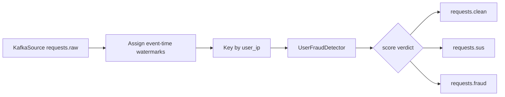

# Flink Processing

## Purpose

`flink_service/fraud_detection.py` is now a starter fraud gate. It keeps the
Kafka and routing skeleton, but the old stateful fraud detector, publisher
profiler, and session analytics stages were removed.

## Current Entry Point

- File: `flink_service/fraud_detection.py`
- Kafka source topic: `requests.raw`
- Consumer group: `flink-fraud-consumer`

## Current Files

| File | Role |
| --- | --- |
| `flink_service/fraud_detection.py` | Flink job wiring, score verdicts, routing, and Kafka sinks |
| `flink_service/user_detector.py` | User/IP scoped stateful rules, currently IP burst |
| `flink_service/rules.py` | Stateless rules list, currently empty |
| `flink_service/events.py` | JSON parsing and event/object extraction helpers |
| `flink_service/constants.py` | Flink thresholds and Kafka constants |
| `shared/schemas.py` | Dataclass event models used inside Python code |

## Current Processing Pipeline



## Current Rule Set

The previous stateful Flink fraud rules were deleted during cleanup. The first
new rule is active now.

| Rule | Scope | Behavior |
| --- | --- | --- |
| IP burst | `user_ip` | More than 8 requests in 60 seconds adds `0.6` and reason `ip_burst` |
| Negative prompt | request | Matching negative-language pattern adds `0.2` and reason `negative_prompt` |
| Bad user-agent | request | Automated/headless user-agent patterns add `0.2` and reason `bad_user_agent` |
| ASN risk | request | ASN in the local high-risk ASN denylist adds `0.2` and reason `asn_risk` |
| Language/country mismatch | request | Non-English language outside expected countries adds `0.1` and reason `language_mismatch_country` |

`flink_service/rules.py` contains the stateless rule list:

```python
RULES = [
    rule_negative_prompt,
    rule_bad_user_agent,
    rule_asn_risk,
    rule_language_mismatch_country,
]
```

English is treated as global for language/country mismatch and does not trigger
that rule. Missing or unknown language/country values do not score in this rule.

Stateful user rules live in `flink_service/user_detector.py`.

Kafka still carries JSON strings. Flink parses those messages into typed request
objects internally and serializes objects back to JSON before writing Kafka
sinks.

Invalid JSON is routed to `requests.fraud` as a blocked event.

## Rule Plan

Add new rules one at a time. Keep each rule small and obvious.

Recommended order:

1. Missing or invalid request fields.
2. Basic prompt repetition rule.
3. Spark-derived ASN risk score loading.
4. Session and publisher scoped rules.

Add stateless rules to `flink_service/rules.py`. Add stateful rules to a scoped
detector module, such as `user_detector.py`, only when they need Flink state.

## Target Forwarding Rule

The starter uses score thresholds to choose target topics:

```text
score < 0.5        -> requests.clean
0.5 <= score < 0.8 -> requests.sus
score >= 0.8       -> requests.fraud
```
