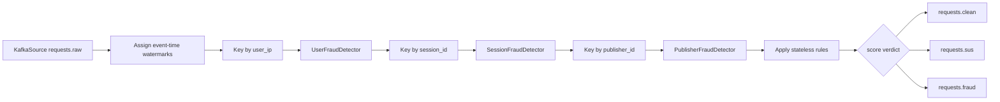

# Flink Processing

## Purpose

`flink_service/fraud_detection.py` is the real-time fraud gate. It consumes raw
requests from Kafka, applies stateless rules + stateful session/publisher
detectors, and routes events by total score.

## Current Entry Point

- File: `flink_service/fraud_detection.py`
- Kafka source topic: `requests.raw`
- Consumer group: `flink-fraud-consumer`

## Current Files

| File | Role |
| --- | --- |
| `flink_service/fraud_detection.py` | Flink job wiring, score verdicts, routing, and Kafka sinks |
| `flink_service/user_detector.py` | User/IP scoped stateful rules, currently IP burst |
| `flink_service/session_detector.py` | Session scoped stateful rules (burst, IP churn, UA churn, country hop, ASN churn, prompt replay, regular cadence) |
| `flink_service/publisher_detector.py` | Publisher scoped stateful rules (burst, burst volume, suspicious rate, bad UA rate, dispersion/farm, prompt replay, geo diversity) |
| `flink_service/rules.py` | Stateless request scoring rules (negative prompt, bad UA, ASN risk, geo-language mismatch) |
| `flink_service/events.py` | JSON parsing and event/object extraction helpers |
| `flink_service/constants.py` | Flink thresholds, rule scores, and Kafka constants |
| `shared/schemas.py` | Dataclass event models used inside Python code |

## Current Processing Pipeline



## Current Thresholds

| Threshold | Value | Meaning |
| --- | --- | --- |
| `SUSPICIOUS_SCORE_THRESHOLD` | 0.45 | score ≥ 0.45 → `requests.sus` |
| `FRAUD_SCORE_THRESHOLD` | 0.55 | score ≥ 0.55 → `requests.fraud` |

Score < 0.45 → `requests.clean`.

## Current Rule Set

### Session-scoped stateful rules

| Rule | Condition | Score | Reason |
| --- | --- | --- | --- |
| Session burst | >12 requests in 60s | 0.4 | `session_burst` |
| Session IP churn | ≥2 unique IPs in 120s | 0.4 | `session_ip_churn` |
| Session UA churn | ≥2 unique user agents in 120s | 0.30 | `session_ua_churn` |
| Session country hop | >2 countries in 120s | 0.5 | `session_country_hop` |
| Session ASN churn | ≥2 unique ASNs in 120s | 0.4 | `session_asn_churn` |
| Prompt replay | ≥90% similar prompt in 300s | 0.4 | `prompt_replay` |
| Regular cadence | Last 4 intervals differ ≤250ms | 0.40 | `regular_cadence` |

### Publisher-scoped stateful rules

| Rule | Condition | Score | Reason |
| --- | --- | --- | --- |
| Publisher burst | >200 requests in 300s | 0.5 | `publisher_burst` |
| Publisher burst volume | ≥20 reqs with ≥6:1 req:IP ratio in 300s | 0.45 | `publisher_burst_volume` |
| Publisher suspicious rate | ≥30 reqs with >10% flagged in 600s | 0.25 | `publisher_suspicious_rate` |
| Publisher bad UA rate | ≥30 reqs with >10% bad UA in 600s | 0.3 | `publisher_bad_ua_rate` |
| Publisher dispersed farm | BOTH new_ip AND new_session AND ratio>0.80 in 1800s | 0.20 | `publisher_dispersed_farm` |
| Publisher prompt replay | Same prompt ≥2 times across sessions in 600s | 0.25 | `publisher_prompt_replay` |
| Publisher geo diversity | ≥5 different countries in 600s | 0.25 | `publisher_geo_diversity` |

### User-scoped stateful rules

| Rule | Condition | Score | Reason |
| --- | --- | --- | --- |
| IP burst | >8 requests in 60s | 0.35 | `ip_burst` |

### Stateless rules (`flink_service/rules.py`)

| Rule | Condition | Score | Reason |
| --- | --- | --- | --- |
| Negative prompt | Matching negative-language pattern | 0.15 | `negative_prompt` |
| Bad user-agent | Automated/headless UA pattern | 0.3 | `bad_user_agent` |
| ASN risk | ASN in high-risk denylist | 0.2 | `asn_risk` |
| Geo-language mismatch | Language→country AND country→language both mismatch | 0.35 | `geo_language_mismatch` |

Stateless rules list in `RULES`:
```python
RULES = [
    rule_negative_prompt,
    rule_bad_user_agent,
    rule_asn_risk,
    rule_geo_language_mismatch,
]
```

## Pipeline Run Results

Full details in `results/pipeline_run_3.md`.

| Metric | Run 2 (old rules) | Run 3 (current) |
|--------|-------------------|-----------------|
| TPR | 20.5% | 59.4% |
| FP | 1,229 | 5,421 |
| Fraud→SUS | 2,029 | 53 |
| Clean→SUS | 8,161 | 1,924 |

## Adding New Rules

Add stateless rules to `flink_service/rules.py` and register in the `RULES`
list. Add stateful rules to a scoped detector module.

Each rule should stay small and obvious. Prefer incremental additions over
large monolithic detectors.

Invalid JSON is routed to `requests.fraud` as a blocked event.
