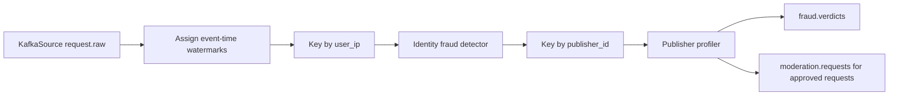

# Flink Processing

## Purpose

`flink_service/fraud_detection.py` is the current real-time fraud detection
service. It consumes raw request events from Kafka, assigns event-time
watermarks, applies identity keyed fraud rules with managed Flink state,
applies publisher keyed profiling, emits verdicts, and forwards approved
requests to moderation.

## Current Entry Point

- File: `flink_service/fraud_detection.py`
- Kafka source topic: `request.raw`
- Consumer group: `flink-fraud-consumer`

## Current Processing Pipeline

## Current Rule Set

| Rule | Description |
| --- | --- |
| IP request frequency | Flag repeated requests from the same IP identity |
| IP event-time burst | Flag more than 8 requests from one identity in 60 event-time seconds |
| Prompt similarity and repetition | Flag repeated normalized prompts in event-time windows and frequency maps |
| Rapid repeat timing | Flag same-IP rapid repeats with mobile/desktop thresholds |
| Suspicious or invalid UA | Score suspicious agents and malformed user agents |
| Language-country mismatch | Score mismatches between language and country |
| Session burst | Score repeated requests from one session |
| Geo churn | Track country distribution and recent country shifts per identity |

## Forwarding Rule

The job forwards `clean` requests to `moderation.requests`. It also forwards
`suspicious` requests when `FORWARD_SUSPICIOUS_TO_MODERATION` is `True` in
`flink_service/constants.py`.
