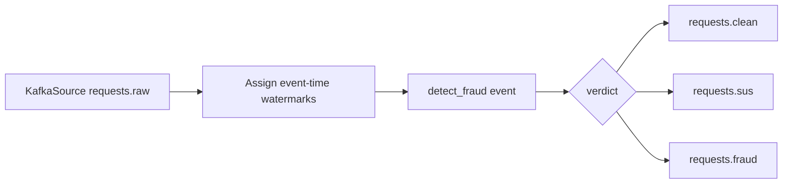

# Flink Processing

## Purpose

`flink_service/fraud_detection.py` is now a starter fraud gate. It keeps the
Kafka and routing skeleton, but the old stateful fraud detector, publisher
profiler, and session analytics stages were removed.

## Current Entry Point

- File: `flink_service/fraud_detection.py`
- Kafka source topic: `requests.raw`
- Consumer group: `flink-fraud-consumer`

## Current Processing Pipeline



## Current Rule Set

The previous stateful Flink fraud rules were deleted during cleanup. There are
no active fraud rules yet.

`detect_fraud(event)` currently returns clean for every valid parsed request:

```python
("clean", 0.0, [])
```

Invalid JSON is routed to `requests.fraud` as a blocked event.

## Rule Plan

Add new rules one at a time. Keep each rule small and obvious.

Recommended order:

1. Missing or invalid request fields.
2. Bad or automated user agent.
3. Basic IP burst rule.
4. Basic prompt repetition rule.
5. Score thresholds for `clean`, `suspicious`, and `fraud`.

Only create a separate `flink_service/rules.py` after `detect_fraud(event)` gets
too large to read comfortably.

## Target Forwarding Rule

The starter keeps the target topic boundaries:

```text
clean      -> requests.clean
suspicious -> requests.sus
fraud      -> requests.fraud
```

Future scoring thresholds can be added after the first real rules exist.
