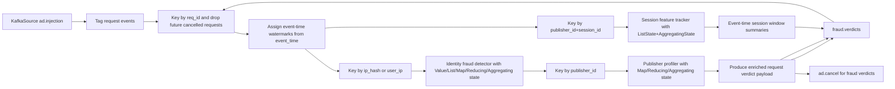

# Flink Processing

## Purpose

`flink_service/fraud_detection.py` is the current real-time fraud detection
service. It consumes shallow-approved request events plus cancel signals from
Kafka, ignores future requests whose `req_id` has already been cancelled,
assigns event-time watermarks from request payload timestamps, applies identity
keyed fraud rules with richer Flink keyed state, applies publisher keyed
profiling, emits verdicts, and can cancel downstream work for hard fraud cases.

## Current Entry Point

- File: `flink_service/fraud_detection.py`
- Kafka source topics: `ad.injection`, `ad.cancel`
- Consumer group: `flink-fraud-consumer`

## Current Processing Pipeline

## Current Rule Set

| Rule | Description | Current source |
| --- | --- | --- |
| IP request frequency | Flag repeated requests from the same IP identity | keyed Flink `ValueState` |
| IP event-time burst | Flag more than 8 requests from one identity in a 60-second event-time window | keyed Flink `ListState` + request timestamps |
| Prompt similarity and repetition | Flag repeated normalized prompts in event-time windows and frequency maps | keyed Flink `ListState` + `MapState` |
| Geo churn | Track country distribution and recent country shifts per identity | keyed Flink `MapState` + `ListState` |
| Session analytics | Track per-session velocity and average requests per session | keyed Flink `MapState` + `AggregatingState` |
| Rolling fraud metrics | Track rolling fraud intensity, suspicious totals, moderation-like hit totals | keyed Flink `ReducingState` |
| Publisher profiling | Track publisher-level prompt/country/identity concentration and averages | second keyed stage by `publisher_id` |
| Shallow context passthrough | Preserve shallow score/flags as metadata for downstream analysis | `shallow_fraud.fraud_score`, `shallow_fraud.flags` |

## Current Implementation Notes

The current file performs the following steps:

1. Creates a `StreamExecutionEnvironment`.
2. Adds Kafka connector jars.
3. Configures a Kafka source for `ad.injection`.
4. Configures a Kafka source for `ad.cancel`.
5. Reads string events with `SimpleStringSchema`.
6. Keys the merged stream by `req_id` and stores cancel state.
7. Drops any later request event for a `req_id` that has already been cancelled.
8. Assigns bounded out-of-orderness watermarks from `event_time` after cancel suppression.
9. Keys surviving request events by `shallow_fraud.identities.ip_hash` with a `user_ip` fallback.
10. Applies identity keyed rule-based fraud logic with managed state primitives.
11. Re-keys identity verdicts by `publisher_id` and applies publisher profiling.
12. In parallel, keys watermarked request events by `publisher_id|session_id`, tracks real-time session features, and emits session-window summaries.
13. Publishes both request verdict and session summary records to `fraud.verdicts`.
14. Publishes `ad.cancel` for hard fraud request verdicts.

## Current Fraud Signals In Code

The current service scores and classifies requests using:

- the keyed count for a specific IP identity exceeds `15`
- more than `8` requests arrive for the same identity inside the trailing `60` event-time seconds
- more than `3` requests from the same identity share the same normalized prompt hash inside the trailing `60` event-time seconds
- repeated normalized prompt hashes indicate potential prompt spam campaigns
- high country churn indicates possible geo anomaly behavior
- rapid inter-request gaps and high session-local velocity indicate automation
- shallow score and flags are forwarded as context only and do not contribute to Flink fraud scoring

Current prompt normalization for similarity checks:

- lowercase prompt text
- remove punctuation
- collapse repeated whitespace
- hash the normalized prompt and compare repeated hashes per keyed identity

## Current Output Shape

The job currently emits a JSON verdict payload with:

- `req_id`
- `event_time`
- `publisher_id`
- `prompt` preview
- `count_from_ip`
- `window_request_count`
- `window_size_seconds`
- `similar_prompt_count`
- `prompt_similarity_window_seconds`
- `normalized_prompt_hash`
- `prompt_repeat_count`
- `session_request_count`
- `country_frequency`
- `publisher_request_count_for_identity`
- `country_top`
- `country_top_frequency`
- `unique_country_count_recent`
- `inter_request_gap_seconds`
- `avg_inter_request_gap_seconds`
- `avg_requests_per_session`
- `avg_fraud_score_recent`
- `rolling_fraud_intensity`
- `rolling_suspicious_count`
- `rolling_moderation_hits`
- `fraud_score`
- `reasons`
- `ip_hash`
- `shallow_fraud_score`
- `shallow_fraud_flags`
- `publisher_profile`
- `verdict`

It also emits session summary records to the same topic with:

- `record_type = session_summary`
- `publisher_session_key`
- `session_window_start`
- `session_window_end`
- `prompts_per_session`
- `avg_typing_gap_seconds`
- `session_duration_seconds`
- `prompt_entropy`
- `conversation_complexity`
- `unique_prompt_hash_count`
- `top_prompt_hash`

## Streaming Concepts In Context

### Keyed streams

The current pipeline uses multiple keyed stages:

- first by `ip_hash` when present and `user_ip` fallback for identity behavior
- then by `publisher_id` for publisher-side profiling

### Stateful stream processing

Fraud detection depends on remembering prior events. The current implementation
uses managed Flink keyed state with TTL including:

- `ValueState` for per-identity total request counters
- `ListState` for recent event history, geo history, prompt hashes, and recent flags
- `MapState` for prompt/country/publisher/session/flag frequencies
- `ReducingState` for rolling fraud and moderation-related aggregates
- `AggregatingState` for online averages such as inter-request gap and session velocity

### Event time and watermarking

The current job assigns bounded out-of-orderness watermarks from each request's
`event_time` after the cancel filter. The current default lateness allowance is
`5` seconds.

This phase adds the first event-time aware fraud signal while keeping the rest
of the service simple. The architecture still supports later adoption of:

- sliding windows
- tumbling windows

These concepts matter for rate spikes, burst analysis, and later session-level
fraud patterns.

## Recommended Future Enhancements Within The Same Direction

| Area | Direction |
| --- | --- |
| Stateful counters | Extend the current keyed state with session and publisher counters |
| Windows | Add tumbling and sliding windows for burst detection |
| Sinks | Add richer downstream sinks beyond `fraud.verdicts` and `ad.cancel` |
| Feature enrichment | Add ASN, device, region, and session signals |
| Score output | Emit fraud scores in addition to binary verdicts |

## CEP And Advanced Detection Ideas

The current architecture is compatible with future Complex Event Processing
without requiring redesign.

Possible CEP directions:

- burst of repeated prompts from one IP range
- many session identifiers switching under the same network identity
- rapid transition from normal prompts to obvious scam prompts
- coordinated publisher-side anomalies across time windows

## Geo And Session Analysis Ideas

Future Flink versions of this service can extend the same pipeline with:

- geo anomalies based on region changes or impossible travel patterns
- session chaining and repeated request-path analysis
- publisher-level abnormal request ratios
- prompt manipulation detection based on token patterns or repeated templates

## Current Prototype Boundary

This file is currently the canonical real-time fraud processor in the
repository and should be treated as the reference point for Flink-based fraud
processing work.
