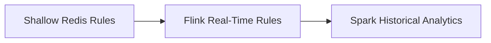

# Fraud Detection Logic

## Objective

This project uses a layered fraud detection strategy that combines fast
screening, real-time stream analysis, and historical model training.

## Detection Philosophy

Fraud is treated as a multi-signal problem rather than a single-rule problem.
The architecture supports several levels of evidence:

- immediate request-level abuse signals
- short-term burst behavior
- session-level repetition
- network-level anomalies
- long-term historical patterns

## Fraud Categories In Scope

| Category | Description |
| --- | --- |
| Click fraud | Artificial interactions intended to inflate ad engagement |
| Impression fraud | Non-genuine exposure generation |
| Bot traffic | Automated or scripted request generation |
| API abuse | Excessive or policy-violating request usage |
| Repeated requests | Duplicate or bursty traffic from the same identity |
| Proxy or VPN abuse | Masked traffic sources associated with evasion |
| Suspicious publishers | Traffic sources with abnormal request behavior |
| Prompt manipulation | Attempts to force sponsored output or bypass controls |

## Layered Detection Strategy

## Shallow Layer Logic

The shallow detector is intended for very fast early decisions.

Current design signals in `shallow_fraud_detection/shallow_fraud_detector.py`:

- IP request frequency window
- user-agent request frequency window
- session request frequency window
- scam keyword penalties
- VPN-related penalty scoring

### Current Shallow Constants

| Constant | Meaning |
| --- | --- |
| `IP_WINDOW = 10` | Short burst window for one IP |
| `UA_WINDOW = 30` | User-agent observation window |
| `SESSION_WINDOW = 60` | Session observation window |
| `MAX_IP_FREQ = 20` | IP threshold |
| `MAX_UA_FREQ = 50` | User-agent threshold |
| `MAX_SESSION_FREQ = 40` | Session threshold |

## Flink Stream-Time Logic

The current real-time prototype in `flink_service/fraud_detection.py` uses:

- prompt keyword inspection
- repeated request counts by `request_context.user_ip`

Current prototype verdict logic:

- mark as `fraud` when prompt contains scam terms
- mark as `fraud` when one IP exceeds 15 requests in the running counter

## Historical Logic In Spark

The Spark layer uses historical logs to derive:

- per-IP request counts
- keyword-presence features
- labeled training data for a fraud classifier

This layer is the foundation for stronger risk scoring that can later inform the
real-time path.

## Example Signal Families

| Signal family | Example uses |
| --- | --- |
| Volume | Request bursts, repeated calls, suspicious frequency spikes |
| Content | Scam keywords, spam text, manipulation phrases |
| Session | Repeated request loops or suspicious session reuse |
| Network | ASN clustering, VPN patterns, region anomalies |
| Behavioral | Abnormal timing, duplicate templates, abnormal engagement patterns |

## Fraud Score Direction

The current code mixes rule-based thresholds with basic scoring ideas. A future
version of the same architecture can formalize this into a composite fraud score
without changing the pipeline structure.

Example scoring direction:

| Signal | Example contribution |
| --- | --- |
| IP threshold exceeded | high risk contribution |
| Scam prompt match | high risk contribution |
| VPN indicator | moderate risk contribution |
| Reused session burst | moderate risk contribution |
| Historical risk score from Spark | context-dependent contribution |

## Planned Detection Extensions

The current architecture naturally supports future additions such as:

- abnormal CTR spike analysis
- publisher-level anomaly scoring
- geo anomaly detection
- session graph analysis
- prompt injection and advertiser manipulation detection

## Engineering Principle

Detection logic should continue to evolve by adding signals to the existing
layers rather than replacing the layers themselves.
