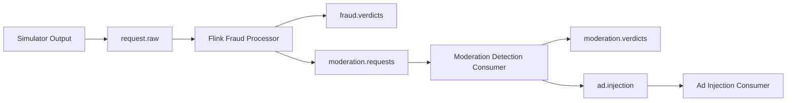

# Kafka Topics

## Topic Inventory

| Topic | Purpose | Current reference | Status |
| --- | --- | --- | --- |
| `request.raw` | Raw ingress topic for simulator output | `kafka/producers/request_simulator.py`, `test_consumer.py`, `flink_service/fraud_detection.py` | Active |
| `moderation.requests` | Fraud-approved requests waiting for moderation | `flink_service/fraud_detection.py`, `pipeline_consumers/moderation_consumer.py`, `test_consumer.py` | Active |
| `ad.injection` | Fully approved request topic consumed by ad injection | `pipeline_consumers/ad_injection_consumer.py`, `pipeline_consumers/moderation_consumer.py`, `test_consumer.py` | Active |
| `fraud.verdicts` | Fraud decisions emitted by the Flink fraud processor | `flink_service/fraud_detection.py`, `test_consumer.py` | Active |
| `moderation.verdicts` | Prompt moderation decisions emitted by moderation consumer | `pipeline_consumers/moderation_consumer.py`, `test_consumer.py` | Active |

## Topic Lifecycle View

## Implementation Notes

- The simulator publishes raw events to `request.raw`.
- Flink consumes `request.raw`, emits `fraud.verdicts`, and forwards approved requests to `moderation.requests`.
- Moderation consumes `moderation.requests`, emits `moderation.verdicts`, and forwards only clean requests to `ad.injection`.
- `spark_service/historical_exporter.py` consumes `request.raw`, `fraud.verdicts`, `moderation.requests`, `moderation.verdicts`, and `ad.injection`.
