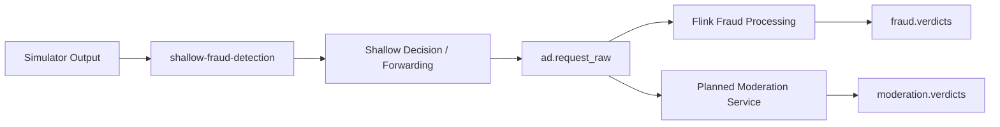

# Kafka Topics

## Role Of Kafka In This Project

Kafka is the event backbone of the system. It separates request generation from
fraud processing, makes consumers independent, and supports future scaling with
partitions and consumer groups.

## Topic Inventory

| Topic | Purpose | Current reference | Status |
| --- | --- | --- | --- |
| `shallow-fraud-detection` | Prototype ingress topic for simulator output | `kafka/producers/request_simulator.py`, `test_consumer.py` | Initial pipeline stage |
| `ad.request_raw` | Raw request stream consumed by Flink | `flink_service/fraud_detection.py` | Active in prototype |
| `fraud.verdicts` | Fraud decisions emitted after stream analysis | `README.md` | Planned topic |
| `moderation.verdicts` | Prompt moderation decisions | `README.md` | Planned topic |
| `ad.candidate` | Approved ad candidate flow | `README.md` | Planned topic |
| `ad.cancel` | Cancelled or rejected ad requests | `README.md` | Planned topic |

## Suggested Reading Of Current State

The repository currently shows both an initial ingress topic and a downstream
raw-request topic. This indicates the system is in the process of connecting the
shallow detection stage to the richer stream-processing stage.

## Event Contract Direction

The current Flink and Spark code imply a request event carrying at least the
following fields:

| Field | Purpose |
| --- | --- |
| `prompt` | Text inspected for scam or abuse indicators |
| `conversation.message_id` | Request-level identifier |
| `metadata.client.ip_hash` | Client identity for safe frequency analysis |
| `metadata.client.asn` | Network-level feature for analytics |
| `metadata.client.device_type` | Device-type feature for analytics |
| `fraud_verdict` | Historical label used in batch training |

## Consumer Groups

Consumer groups are a key streaming concept for this project.

| Consumer group idea | Purpose |
| --- | --- |
| `flink-consumer` | Current Flink group for raw request analysis |
| fraud-processing groups | Scale real-time fraud processors horizontally |
| moderation groups | Scale planned moderation processors independently |
| analytics export groups | Capture historical logs for Spark input |

## Streaming Concepts To Preserve

### Durability

Kafka allows event replay for debugging, backfills, and model-validation runs.

### Decoupling

The producer does not need to know how many downstream processors exist.

### Parallelism

Partitioning allows future expansion of Flink jobs and additional stream
consumers without changing the architectural foundation.

## Topic Lifecycle View

## Implementation Notes

- The Flink job currently consumes `ad.request_raw`.
- The debug consumer currently listens to `shallow-fraud-detection`.
- Topic standardization should be handled as a continuation of the current
  architecture, not as a redesign.

## Future Topic Extensions

Likely future topics that still fit the current system direction:

- historical export topics for training data capture
- enriched request streams after shallow checks
- joined decision streams for final ad serving decisions
