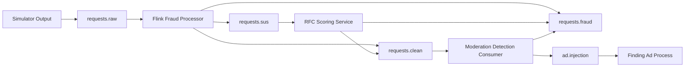

# Kafka Topics

## Topic Inventory

| Topic | Purpose | Current reference | Status |
| --- | --- | --- | --- |
| `requests.raw` | Raw ingress topic for sender output and Flink fraud detection | `kafka/producers/requests_sender.py`, `test_consumer.py`, `flink_service/fraud_detection.py` | Active target |
| `requests.sus` | Suspicious requests from Flink waiting for RFC model scoring | `flink_service/fraud_detection.py`, planned `scoring_service/` | Active target |
| `requests.clean` | Fraud-clean requests ready for moderation | `flink_service/fraud_detection.py`, `scoring_service/rfc_scoring_service.py`, `moderation_service/moderation_consumer.py` | Active target |
| `requests.fraud` | Blocked fraud or unsafe request events for logs and Spark | `flink_service/fraud_detection.py`, `scoring_service/rfc_scoring_service.py`, `moderation_service/moderation_consumer.py` | Active target |
| `ad.injection` | Fully approved request topic consumed by ad finding | `pipeline_consumers/ad_injection_consumer.py`, `moderation_service/moderation_consumer.py`, `test_consumer.py` | Active |

## Topic Lifecycle View

## Implementation Notes

- The requests sender publishes raw events to `requests.raw`.
- Flink consumes `requests.raw` and routes requests to `requests.clean`, `requests.sus`, or `requests.fraud`.
- The RFC scoring service consumes `requests.sus` and routes requests to `requests.clean` or `requests.fraud`.
- Moderation consumes `requests.clean` and routes requests to `ad.injection` or `requests.fraud`.
- `requests.fraud` contains only blocked negative events from Flink, RFC scoring, or moderation.
- Spark/export work should account for `requests.raw`, `requests.sus`, `requests.clean`, `requests.fraud`, and `ad.injection`.
