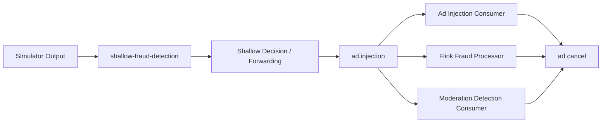

# Kafka Topics

## Role Of Kafka In This Project

Kafka is the event backbone of the system. It separates request generation from
fraud processing, makes consumers independent, and supports future scaling with
partitions and consumer groups.

## Topic Inventory

| Topic | Purpose | Current reference | Status |
| --- | --- | --- | --- |
| `shallow-fraud-detection` | Prototype ingress topic for simulator output | `kafka/producers/request_simulator.py`, `test_consumer.py` | Initial pipeline stage |
| `ad.injection` | Shared downstream request topic for ad injection, moderation, and Flink fraud processing | `shallow_fraud_detection/shallow_fraud_consumer.py`, `pipeline_consumers/ad_injection_consumer.py`, `pipeline_consumers/moderation_consumer.py`, `flink_service/fraud_detection.py` | Active in prototype |
| `ad.cancel` | Cross-consumer cancellation signal for in-flight downstream work and Flink-side request suppression | `pipeline_consumers/ad_injection_consumer.py`, `pipeline_consumers/moderation_consumer.py`, `flink_service/fraud_detection.py` | Active in prototype |
| `ad.request_raw` | Older raw request topic referenced by the initial Flink prototype | `README.md` | Legacy prototype reference |
| `fraud.verdicts` | Fraud decisions emitted by the Flink fraud processor | `flink_service/fraud_detection.py`, `test_consumer.py` | Active in prototype |
| `moderation.verdicts` | Prompt moderation decisions emitted by moderation consumer | `pipeline_consumers/moderation_consumer.py`, `test_consumer.py`, `README.md` | Active in prototype |
| `ad.candidate` | Approved ad candidate flow | `README.md` | Planned topic |

## Suggested Reading Of Current State

The repository still references both a shared downstream fan-out topic and an
older raw-request topic. The active Flink path now consumes `ad.injection` and
publishes to `fraud.verdicts`, while `ad.request_raw` remains as a legacy
prototype reference.

## Event Contract Direction

The current Flink and Spark code imply a request event carrying at least the
following fields:

| Field | Purpose |
| --- | --- |
| `prompt` | Text inspected for scam or abuse indicators |
| `req_id` | Request-level identifier (random hex) |
| `request_context.user_ip` | Client IP fallback for frequency analysis |
| `optional_context.asn` | Network-level feature for analytics |
| `publisher_id` | Traffic source identifier for analytics |
| `shallow_fraud.identities.ip_hash` | Stable keyed identity for Flink state |
| `shallow_fraud.fraud_score` | Shallow-stage score reused during stream scoring |
| `fraud_verdict` | Historical label used in batch training |

## Consumer Groups

Consumer groups are a key streaming concept for this project.

| Consumer group idea | Purpose |
| --- | --- |
| `ad-injection-consumer` | Placeholder ad injection worker that receives all fan-out events |
| `moderation-detection-consumer` | Moderation worker that receives fan-out events and emits moderation verdicts |
| `flink-fraud-consumer` | Current Flink group for downstream fraud analysis |
| fraud-processing groups | Scale real-time fraud processors horizontally |
| moderation groups | Scale planned moderation processors independently |
| analytics export groups | Capture historical logs for Spark input |

## Streaming Concepts To Preserve

### Durability

Kafka allows event replay for debugging, backfills, and model-validation runs.

### Decoupling

The producer does not need to know how many downstream processors exist.

### Parallelism

Partitioning allows future expansion of Flink jobs and additional stream
consumers without changing the architectural foundation.

## Topic Lifecycle View

## Implementation Notes

- The shallow consumer currently forwards allowed events to `ad.injection`.
- The ad injection consumer, moderation consumer, and Flink fraud processor each use distinct consumer groups so they all receive the same request in parallel.
- Each downstream consumer also listens to `ad.cancel` and can stop in-flight work when another consumer emits a matching cancel message.
- The canonical Flink fraud job consumes `ad.injection` and `ad.cancel`, emits `fraud.verdicts`, and can emit `ad.cancel`.
- If Flink has already observed an `ad.cancel` for a `req_id`, later `ad.injection` events for that same `req_id` are dropped before fraud scoring.
- Topic standardization should be handled as a continuation of the current
  architecture, not as a redesign.

## Future Topic Extensions

Likely future topics that still fit the current system direction:

- historical export topics for training data capture
- enriched request streams after shallow checks
- joined decision streams for final ad serving decisions
