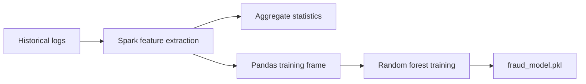

# ML Pipeline

## Role Of Machine Learning In This Project

Machine learning is the long-horizon intelligence layer of the fraud system. It
does not replace shallow rules or real-time stream processing. Instead, it learns
patterns from historical data and produces models or risk indicators that can
improve future detection quality.

## Current Training Entry Point

- File: `spark_service/spark_training.py`
- Current model type: `RandomForestClassifier`

## Current Training Flow

## Current Features Used

| Feature | Description |
| --- | --- |
| `contains_scam` | Binary feature derived from prompt regex matching |
| `asn` | Network-level numerical feature |
| `label` | Fraud label based on historical verdicts |

## Planned Feature Growth

The architecture supports gradual feature expansion while keeping the same batch
training structure.

Potential future features:

- per-IP request volume statistics
- session length and session reuse counts
- prompt-template repetition rates
- publisher-level conversion or rejection ratios
- device-type distribution anomalies
- geo variance or ASN instability features

## Model Evolution Path

The current prototype uses a random forest because it is practical for an early
supervised baseline. Future versions can still keep the same pipeline while
experimenting with additional models.

Potential model families:

| Model | Why it is relevant |
| --- | --- |
| Random Forest | Strong baseline for structured tabular fraud data |
| Isolation Forest | Useful for anomaly-oriented detection without strong labels |
| XGBoost | Powerful gradient-boosted model for richer tabular features |
| Autoencoder | Useful for unsupervised anomaly detection on higher-dimensional behavior patterns |

## Retraining Direction

Possible retraining strategies that fit the current architecture:

- retrain after accumulating enough new labeled requests
- retrain on synthetic and historical mixed datasets
- compare baseline rules against model-assisted decisions
- export summary features back into the streaming stack as enrichment inputs

## Labeling Strategy

The current code derives labels from `fraud_verdict`. Over time, labels can be
strengthened by combining:

- shallow fraud decisions
- Flink stream verdicts
- moderation outcomes
- later human or evaluation feedback

## Synthetic Data Role

Synthetic traffic is especially important in this project because it enables:

- early experimentation before large real datasets exist
- balanced fraud vs normal traffic generation
- attack-mode simulations for regression testing

## Key Principle

The ML pipeline should remain connected to the existing Spark job boundary:

- logs in
- features engineered
- model trained
- artifacts saved

This preserves continuity for future development sessions.
