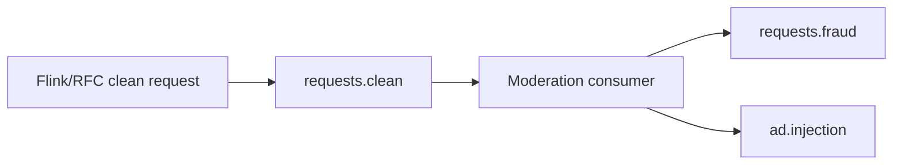

# Moderation Pipeline Plan

## Current Direction

The moderation pipeline is sequential, not parallel.

## Immediate Goals

1. Keep the default mock mode for reliable local tests.
2. Support `MODERATION_PROVIDER=openai` through `.env`.
3. Add TF-IDF/cosine-similarity gating before selective OpenAI calls.
