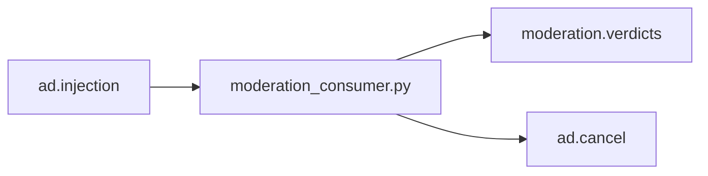

# Moderation Pipeline Plan

## Goal

Build and preserve a lightweight moderation stage that is:

- low latency
- stream friendly
- Flink compatible
- rule based only
- easy to extend without heavy ML dependencies

## 1. Architecture Changes

The moderation pipeline remains a parallel downstream consumer of `ad.injection`.

Current runtime shape:

Implementation changes:

- keep moderation out of the shallow Redis layer to avoid mixing traffic abuse and content policy logic
- keep moderation separate from the Flink fraud processor so each stage can evolve independently
- emit richer moderation verdicts that downstream Flink, Spark, or analytics jobs can consume later
- isolate normalization and matching logic in `pipeline_consumers/moderation_rules.py`

## 2. Normalization Pipeline

Normalization should stay deterministic and cheap.

Applied steps:

1. lowercase prompt text
2. Unicode normalize with `NFKC`
3. normalize simple leetspeak substitutions
4. remove punctuation by converting it to spaces
5. collapse repeated whitespace

This gives the moderation matcher a stable text representation while preserving a
small diagnostics block for observability.

Tracked diagnostics:

- Unicode-changed prompt
- leetspeak-changed prompt
- punctuation removed count
- whitespace collapse flag
- repeated-character sequences
- punctuation bursts
- URL-like substrings
- non-ASCII count

## 3. Aho-Corasick Integration

The moderation matcher uses an in-repo pure-Python Aho-Corasick automaton.

Reasons:

- one-pass multi-keyword matching
- linear scan over normalized prompt text
- category-aware outputs
- no external moderation APIs
- no transformer or embedding dependency
- portable for local scripts and future Flink operators

Implementation notes:

- compile the trie once at process startup
- normalize keywords with the same pipeline as prompts
- store category and canonical keyword in terminal outputs
- dedupe matches per category for verdict readability while still exposing total hit count

## 4. Category Design

Current categories:

- `SCAM`
- `JAILBREAK`
- `PROMPT_INJECTION`
- `SPAM`
- `PHISHING`
- `NSFW`

Design rules:

- keep categories coarse and operationally useful
- prefer stable category names over very fine-grained subtypes
- let keyword lists grow without schema changes
- allow one prompt to match multiple categories

Keyword set evolution should remain file-based and version-controlled.

## 5. State Usage In Flink

The current moderation prototype keeps repeated-hit state in the Python consumer
for low-friction rollout.

Flink-compatible next step:

- ingest `moderation.verdicts` as a side stream or joined stream
- key by `publisher_id|session_id|ip_hash`
- maintain rolling state for repeated moderation hits
- aggregate category frequency over event time windows
- feed moderation counts into fraud scoring and publisher profiling

Recommended Flink state primitives for a future dedicated moderation stream job:

- `ValueState` for last-hit timestamp and rolling counters
- `ReducingState` for cumulative moderation intensity
- `MapState` for category frequency histograms
- `ListState` for recent matched-category history

This keeps the moderation schema immediately usable by Flink without forcing the
moderation consumer itself into a heavy stream processor.

## 6. Moderation Scoring

Scoring should remain additive, transparent, and cheap.

Current design:

- base weight per matched category
- small incremental weight per matched keyword
- heuristic boosts for:
  - phishing URL indicators
  - excessive punctuation
  - repeated characters
  - Unicode obfuscation
- behavioral boost for repeated moderation hits in the rolling identity window

Scoring goals:

- preserve explainability
- keep thresholds easy to tune from sample traffic
- support fast severity-based cancellation decisions

Operational thresholds:

- `clean`: no categories and no strong heuristic flags
- `flagged`: one or more categories or strong heuristic flags
- `cancel_downstream`: severe category hit or accumulated score threshold

## 7. Migration Steps

1. Introduce the normalization and matcher module.
2. Swap simple substring checks for compiled Aho-Corasick matching.
3. Extend verdict schema with categories, score, flags, and diagnostics.
4. Add rolling repeated-hit behavior tracking inside the moderation consumer.
5. Update documentation for moderation outputs and implementation status.
6. Verify locally with representative scam, phishing, jailbreak, and spam prompts.
7. Optionally wire `moderation.verdicts` into later Flink enrichment work.

## 8. Future Extensibility

Low-cost extensions that preserve the architecture:

- category-specific threshold tuning
- separate keyword packs per language
- domain reputation deny-lists for phishing URLs
- prompt-template repetition analytics by publisher or session
- rule versioning in moderation verdicts
- Spark-side offline calibration of category weights
- Flink-side joins between fraud and moderation streams

Avoid unless requirements change:

- LLM-based moderation
- embedding similarity search
- external moderation API dependencies
- heavyweight content classifiers on the hot path

## Scalability Notes

The design scales because it keeps the hot path simple:

- prompt normalization is linear in prompt length
- Aho-Corasick matching is linear in prompt length after compile time
- rolling behavior state is keyed and bounded by a time window
- emitted verdicts are compact JSON records that downstream Flink and Spark jobs can consume directly
