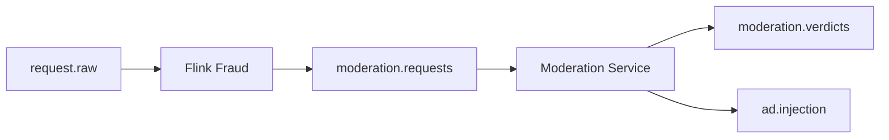

# Moderation Service

## Status

Prototype implementation is present in `pipeline_consumers/moderation_consumer.py`.

## Purpose

The moderation service analyzes prompt content that may be unsafe,
manipulative, spam-like, or designed to exploit the ad-injection mechanism of
an AI monetization platform.

## Current Responsibilities

| Responsibility | Description |
| --- | --- |
| Provider configuration | Read moderation provider settings and secrets from `.env` |
| Prompt caching | Cache normalized prompts to avoid repeat provider calls |
| Mock moderation | Default local mode uses rule-based moderation for repeatable tests |
| OpenAI moderation | Optional provider mode uses the OpenAI Moderation API |
| Moderation verdict publication | Emit results to `moderation.verdicts` |
| Final approval forwarding | Publish only clean requests to `ad.injection` |

## Planned Streaming Position

