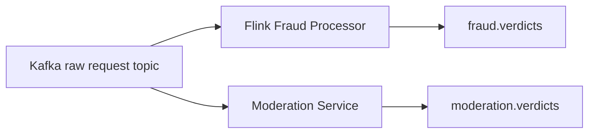

# Moderation Service

## Status

This is a planned service in the current architecture direction.

## Purpose

The moderation service is intended to analyze prompt content that may be unsafe,
manipulative, spam-like, or designed to exploit the ad-injection mechanism of an
AI monetization platform.

## Why Moderation Belongs Here

Fraud detection and moderation are related but not identical.

- Fraud focuses on traffic abuse, automation, and suspicious behavioral patterns.
- Moderation focuses on prompt content risk and policy-violating text patterns.

Keeping moderation as a dedicated service matches the broader architecture while
allowing both systems to evolve independently.

## Planned Responsibilities

| Responsibility | Description |
| --- | --- |
| Prompt abuse detection | Detect prompts crafted to manipulate sponsored output |
| Spam detection | Identify repetitive or low-quality promotional content |
| Advertiser manipulation prevention | Flag attempts to force, bias, or game ad selection |
| Unsafe prompt filtering | Detect content that should not proceed to monetization logic |
| Prompt injection detection | Detect instructions intended to override system behavior |

## Planned Streaming Position

## Potential Moderation Signals

Examples of patterns this service may eventually inspect:

- scam-style vocabulary
- spam repetition
- policy bypass phrases
- prompt injection markers
- advertiser favoritism attempts
- suspicious formatting templates repeated at scale

## Relationship To Fraud Decisions

The moderation service can complement fraud detection in several ways:

- prompts can be clean from a rate-limit perspective but unsafe in content
- prompts can be suspicious in content even when traffic volume appears normal
- moderation verdicts can become features for Spark retraining or downstream final decisions

## Future Integration Notes

The repository already references `moderation.verdicts` in the top-level README.
That topic should be considered the planned output channel for this service.

## Boundary

This service is planned and documented so that future AI agents can implement it
consistently with the existing architecture rather than inventing a new one.
