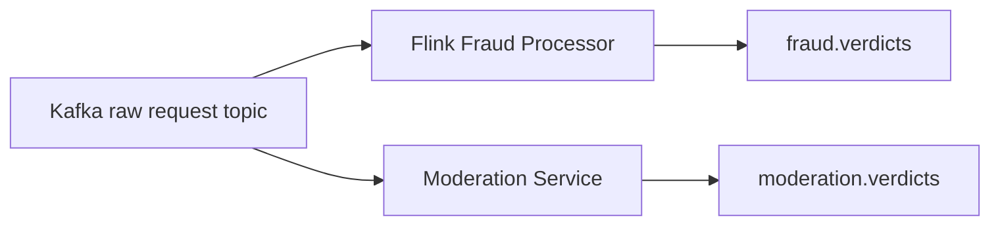

# Moderation Service

## Status

Prototype implementation is now present in `pipeline_consumers/moderation_consumer.py`.

## Purpose

The moderation service is intended to analyze prompt content that may be unsafe,
manipulative, spam-like, or designed to exploit the ad-injection mechanism of an
AI monetization platform.

## Why Moderation Belongs Here

Fraud detection and moderation are related but not identical.

- Fraud focuses on traffic abuse, automation, and suspicious behavioral patterns.
- Moderation focuses on prompt content risk and policy-violating text patterns.

Keeping moderation as a dedicated service matches the broader architecture while
allowing both systems to evolve independently.

## Current Responsibilities

| Responsibility | Description |
| --- | --- |
| Prompt normalization | Lowercase, Unicode-normalize, de-punctuate, collapse whitespace, and normalize simple leetspeak before matching |
| Category-based matching | Run one-pass Aho-Corasick matching over normalized prompts for `SCAM`, `JAILBREAK`, `PROMPT_INJECTION`, `SPAM`, `PHISHING`, and `NSFW` keywords |
| Lightweight heuristics | Detect excessive punctuation, repeated characters, Unicode obfuscation, and URL-like phishing indicators |
| Behavioral moderation analytics | Track repeated moderation hits per publisher/session/identity key inside the stream consumer |
| Moderation verdict publication | Emit rich moderation results to `moderation.verdicts` |
| Downstream interruption on flagged prompts | Emit `ad.cancel` when severe or repeated moderation hits are detected |

## Planned Responsibilities

| Responsibility | Description |
| --- | --- |
| Prompt abuse detection | Detect prompts crafted to manipulate sponsored output |
| Spam detection | Identify repetitive or low-quality promotional content |
| Advertiser manipulation prevention | Flag attempts to force, bias, or game ad selection |
| Unsafe prompt filtering | Detect content that should not proceed to monetization logic |
| Prompt injection detection | Detect instructions intended to override system behavior |

## Planned Streaming Position

## Potential Moderation Signals

Examples of patterns the current lightweight pipeline now inspects or is designed to extend:

- scam-style vocabulary
- jailbreak phrases
- prompt-injection attempts
- phishing account-verification patterns
- spam repetition
- policy bypass phrases
- prompt injection markers
- advertiser favoritism attempts
- suspicious formatting templates repeated at scale
- excessive punctuation bursts
- repeated character spam
- Unicode-based obfuscation
- repeated moderation hits over a short stream window

## Relationship To Fraud Decisions

The moderation service can complement fraud detection in several ways:

- prompts can be clean from a rate-limit perspective but unsafe in content
- prompts can be suspicious in content even when traffic volume appears normal
- moderation verdicts can become features for Spark retraining or downstream final decisions

## Future Integration Notes

The repository references `moderation.verdicts` in the top-level README. The
moderation consumer now emits to this topic directly.

## Current Boundary

The moderation implementation remains intentionally lightweight for stream use:

- no LLMs, transformers, embeddings, or external moderation APIs
- pure Python normalization and Aho-Corasick-style matching only
- in-consumer rolling behavior state rather than a dedicated Flink moderation job
- no model-based moderation
- no advanced semantic understanding beyond rules and heuristics

## Current Output Shape

The moderation consumer now emits:

- moderation flags
- matched categories and keywords
- moderation score
- normalization diagnostics
- behavioral hit counters
- downstream cancel intent

## Implementation Plan

The detailed rollout plan for this moderation pipeline now lives in
`docs/moderation_pipeline_plan.md`.
