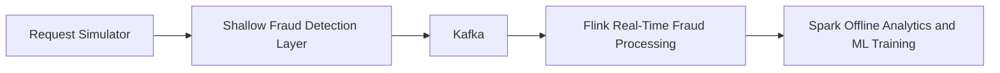

# Project Overview

## Purpose

This repository contains a university project for the course `Massive Data Mining`.
It explores real-time fraud detection for AI advertising systems inspired by
[Adstract AI](https://docs.adstract.ai/overview/?utm_source=chatgpt.com), a
platform that injects sponsored suggestions into AI-generated responses when the
context is relevant.

The project focuses on the fraud-detection side of that ecosystem. The goal is
to detect suspicious advertising requests, abusive traffic patterns, and prompt
manipulation signals early enough to protect downstream monetization services.

## Core Idea

The system follows a hybrid streaming plus batch architecture:

1. Generate or ingest AI ad-request traffic.
2. Apply a shallow Redis-backed fraud screen.
3. Stream accepted events through Kafka.
4. Run real-time fraud analysis in Flink.
5. Run offline analytics and model training in Spark.

This architecture is intentionally kept as the project foundation.

## Project Scope

The system is designed to reason about fraud patterns such as:

- click fraud
- impression fraud
- bot traffic
- repeated automated sessions
- API abuse
- suspicious request bursts
- proxy or VPN abuse
- suspicious publishers
- prompt manipulation attempts
- abnormal engagement patterns that may later extend to CTR anomaly detection

## Technology Stack

| Area | Technology |
| --- | --- |
| Programming language | Python |
| Event streaming | Apache Kafka |
| Fast counters / temporary state | Redis |
| Real-time stream processing | PyFlink |
| Offline analytics | PySpark |
| ML training | scikit-learn |
| Local development infra | Docker Compose |

## High-Level Pipeline

## Repository Landmarks

| Path | Role |
| --- | --- |
| `README.md` | Top-level quick start and repository summary |
| `docker-compose.yml` | Local Kafka and Redis infrastructure |
| `kafka/producers/request_simulator.py` | Prototype request generator |
| `shallow_fraud_detection/shallow_fraud_detector.py` | Redis-backed shallow fraud layer scaffold |
| `pipeline_consumers/` | Placeholder downstream consumers and shared Kafka fan-out utilities |
| `test_consumer.py` | Debug consumer for local message inspection |
| `flink_service/fraud_detection.py` | Current real-time fraud detection prototype |
| `spark_service/spark_training.py` | Current offline analytics and model training prototype |

## Documentation Map

| Document | Focus |
| --- | --- |
| `docs/current_architecture.md` | Preserved architecture and component responsibilities |
| `docs/event_flow.md` | Request lifecycle and event movement |
| `docs/kafka_topics.md` | Topic contracts and streaming boundaries |
| `docs/flink_processing.md` | Real-time detection design and current implementation |
| `docs/spark_analytics.md` | Offline analytics and historical processing |
| `docs/redis_strategy.md` | Counter, cache, and shallow-detection strategy |
| `docs/fraud_detection_logic.md` | Rule logic, scoring, and fraud categories |
| `docs/event_schemas.md` | Current JSON payloads across the request and shallow-fraud pipeline |
| `docs/shallow_fraud_checks.md` | Exact shallow detector checks and thresholds |
| `docs/ml_pipeline.md` | Training pipeline and future model evolution |
| `docs/request_simulator.md` | Synthetic traffic generation strategy |
| `docs/moderation_service.md` | Planned moderation service |
| `docs/datasets.md` | Datasets, labels, and synthetic data plans |
| `docs/docker_setup.md` | Local infrastructure and run instructions |
| `docs/scalability.md` | Scaling direction within the current architecture |
| `docs/roadmap.md` | Near-term and future implementation roadmap |
| `docs/implementation_status.md` | Current implementation state |
| `docs/glossary.md` | Shared terminology |

## Current Engineering Position

This repository should be treated as an early-stage distributed fraud detection
platform with a valid architecture and an initial prototype implementation.

Current emphasis:

- preserve the architecture
- extend the implementation incrementally
- keep Kafka, Redis, Flink, and Spark as the core pipeline
- document the intended behavior clearly enough for future AI agents to resume work immediately

## Recommended Reading Order

1. `docs/current_architecture.md`
2. `docs/event_flow.md`
3. `docs/implementation_status.md`
4. `docs/flink_processing.md`
5. `docs/spark_analytics.md`
6. `docs/fraud_detection_logic.md`
