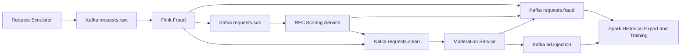

# Project Overview

## Purpose

This repository contains a university project for the course `Massive Data Mining`.
It explores real-time fraud detection and moderation for AI advertising systems
that only inject sponsored output for safe requests.

## Core Idea

The system follows a hybrid streaming plus batch architecture:

1. Generate or ingest AI ad-request traffic.
2. Publish raw requests to Kafka.
3. Run real-time shallow fraud analysis in Flink.
4. Send suspicious requests to RFC model scoring.
5. Send fraud-clean requests to moderation.
6. Forward moderation-approved requests to ad injection.
7. Run offline analytics and model training in Spark.

## Technology Stack

| Area | Technology |
| --- | --- |
| Programming language | Python |
| Event streaming | Apache Kafka |
| Real-time stream processing | PyFlink |
| Moderation API | OpenAI Moderation API |
| Offline analytics | PySpark |
| ML training | scikit-learn |
| Local development infra | Docker Compose |

## High-Level Pipeline

## Repository Landmarks

| Path | Role |
| --- | --- |
| `README.md` | Top-level quick start and repository summary |
| `docker-compose.yml` | Local Kafka infrastructure |
| `kafka/producers/request_simulator.py` | Prototype request generator |
| `flink_service/fraud_detection.py` | Current real-time fraud detection prototype |
| `pipeline_consumers/moderation_consumer.py` | Moderation prototype with `.env` configuration |
| `pipeline_consumers/ad_injection_consumer.py` | Placeholder ad-injection consumer |
| `spark_service/spark_training.py` | Current offline analytics and model training prototype |

## Documentation Map

| Document | Focus |
| --- | --- |
| `docs/current_architecture.md` | Preserved architecture and component responsibilities |
| `docs/event_flow.md` | Request lifecycle and event movement |
| `docs/kafka_topics.md` | Topic contracts and streaming boundaries |
| `docs/flink_processing.md` | Real-time detection design and current implementation |
| `docs/flink_fraud_detection_rules.md` | Implemented Flink fraud rules grouped by user, session, publisher, and request signals |
| `docs/spark_analytics.md` | Offline analytics and historical processing |
| `docs/fraud_detection_logic.md` | Rule logic, scoring, and fraud categories |
| `docs/event_schemas.md` | Current JSON payloads across the pipeline |
| `docs/request_simulator.md` | Synthetic traffic generation strategy |
| `docs/moderation_service.md` | Moderation stage responsibilities |
| `docs/implementation_status.md` | Current implementation state |
| `docs/new_architecture_plan/` | Phased plan for the new topic and service architecture |

## Current Engineering Position

This repository should be treated as an early-stage distributed fraud and
moderation platform with a valid architecture and an initial prototype
implementation.

Current emphasis:

- preserve the architecture
- extend the implementation incrementally
- keep Kafka, Flink, moderation, and Spark as the core pipeline
- document the intended behavior clearly enough for future AI agents to resume work immediately
