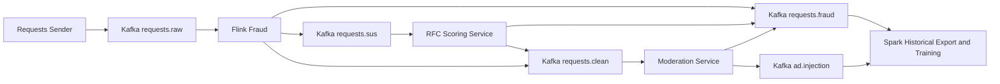

# Project Overview

## Purpose

This repository contains a university project for the course `Massive Data Mining`.
It explores real-time fraud detection and moderation for AI advertising systems
that only inject sponsored output for safe requests.

## Core Idea

The system follows a hybrid streaming plus batch architecture:

1. Generate or ingest AI ad-request traffic.
2. Publish raw requests to Kafka.
3. Run real-time shallow fraud analysis in Flink.
4. Send suspicious requests to RFC model scoring.
5. Send fraud-clean requests to moderation.
6. Forward moderation-approved requests to ad injection.
7. Run offline analytics and model training in Spark.

## Technology Stack

| Area | Technology |
| --- | --- |
| Programming language | Python |
| Event streaming | Apache Kafka |
| Real-time stream processing | PyFlink |
| Moderation API | OpenAI Moderation API |
| Offline analytics | PySpark |
| ML training | scikit-learn |
| Local development infra | Docker Compose |

## High-Level Pipeline

## Repository Landmarks

| Path | Role |
| --- | --- |
| `README.md` | Top-level quick start and repository summary |
| `docker-compose.yml` | Local Kafka infrastructure |
| `kafka/producers/requests_sender.py` | Labeled request dataset sender |
| `flink_service/fraud_detection.py` | Real-time fraud detection with session + publisher detectors |
| `scoring_service/rfc_scoring_service.py` | Kafka-based RFC model scorer for suspicious events |
| `pipeline_consumers/moderation_consumer.py` | Moderation prototype with `.env` configuration |
| `pipeline_consumers/ad_injection_consumer.py` | Placeholder ad-injection consumer |
| `spark_service/spark_training.py` | Offline RFC model training from exported Flink logs |
| `spark_service/historical_exporter.py` | Exports Flink output topics joined with offline labels |

## Documentation Map

| Document | Focus |
| --- | --- |
| `docs/current_architecture.md` | Architecture, event flow, topic boundaries, and component responsibilities |
| `docs/kafka_topics.md` | Topic contracts and streaming boundaries |
| `docs/flink_processing.md` | Current Flink rule set and processing pipeline |
| `docs/spark_analytics.md` | Spark placeholder until a new plan is written |
| `docs/event_schemas.md` | Current JSON payloads across the pipeline |
| `docs/requests_sender.md` | Labeled request replay strategy |
| `docs/fraud_scripts.md` | How to append labeled fraud traffic |
| `docs/moderation_service.md` | Moderation responsibilities and near-term plan |
| `docs/implementation_status.md` | Current implementation state and pipeline run results |
| `docs/new_architecture_plan/` | Phased plan for the new topic and service architecture |
| `docs/pipeline_results.md` | Latest full Kafka streaming validation for Flink + RFC |

## Current Engineering Position

This repository should be treated as an early-stage distributed fraud and
moderation platform with a valid architecture and an initial prototype
implementation.

Current emphasis:

- preserve the architecture
- extend the implementation incrementally
- keep Kafka, Flink, moderation, and Spark as the core pipeline
- keep the validated Flink + RFC loop above 70% fraud TPR with <1,000 false positives
- finish moderation, ad finding, orchestration, and automated regression checks
- document the intended behavior clearly enough for future AI agents to resume work immediately
