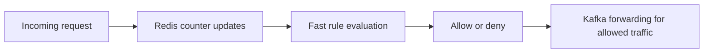

# Redis Strategy

## Purpose

Redis is the low-latency memory layer for shallow fraud detection. It is used to
track short-lived counters and temporary state that must be read and updated in
milliseconds.

## Current Code Anchor

- File: `shallow_fraud_detection/shallow_fraud_detector.py`
- Redis connection: `localhost:6379`

## Why Redis Fits This Layer

| Need | Redis benefit |
| --- | --- |
| Fast counters | Atomic increments for high-frequency request tracking |
| Short windows | Natural fit for TTL-based rate limiting |
| Temporary state | Efficient storage for short-lived sessions and fingerprints |
| Local development | Simple setup through Docker Compose |

## Current Intended Redis Responsibilities

The shallow detector is designed to use Redis for:

- per-IP counters
- per-user-agent counters
- per-session counters
- temporary request history
- early fraud scoring inputs
- future fraud score caching

## Current Rule Windows In Code

`ShallowFraudDetector` currently uses Redis for these short-lived checks:

| Signal | Window | Rule |
| --- | --- | --- |
| IP last seen | 60 seconds | flag `ip_burst` when the same IP repeats within 3s for phone/tablet UAs or 2s for desktop/other UAs |
| Session frequency | 60 seconds | flag `session_burst` when one session exceeds 40 requests |

## Current Penalties In Code

| Penalty | Value |
| --- | --- |
| Suspicious user-agent heuristic | `0.1` |
| Negative keyword prompt match | `0.4` |
| Invalid user-agent | `0.2` |
| Language-country mismatch | `0.2` |

## Suggested Redis Key Patterns

These key families align with the current architecture and detector design:

| Key pattern | Purpose |
| --- | --- |
| `fraud:last_seen:ip:{ip_hash}` | Track the last time one IP was seen for rapid-repeat checks |
| `fraud:session:{session_id}` | Count requests within one session |
| `fraud:score:{request_id}` | Cache early fraud score for downstream use |
| `fraud:last_seen:{identity}` | Track recent activity timestamps |

## TTL Strategy

Redis is especially useful because the project relies on short observation
windows. A simple pattern is:

1. increment the key or update a last-seen timestamp
2. set or preserve TTL
3. interpret the resulting state as a shallow fraud signal

This fits the current shallow fraud layer design directly.

## Redis In The Event Pipeline

## Future Redis Extensions Within Current Architecture

| Area | Direction |
| --- | --- |
| Counters | More granular counters by ASN, publisher, region, or prompt family |
| Fingerprints | Device or session fingerprints for repeat abuse detection |
| Caching | Cache recent fraud verdicts for fast deduplication |
| Coordination | Store short-lived join state between fraud and moderation decisions |

## Engineering Notes

- Redis should stay focused on shallow and temporary decision support.
- Long-lived historical analysis belongs in Spark, not Redis.
- Complex event correlation belongs in Flink or a higher-level coordination
  layer, while Redis remains the fast lookup and counter store.
