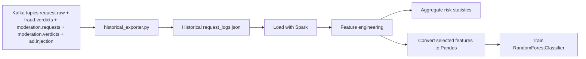

# Spark Analytics

## Purpose

`spark_service/historical_exporter.py` and `spark_service/spark_training.py`
provide the batch analytics side of the system. Together they are responsible
for building historical request logs from Kafka topics, deriving aggregate risk
signals, and training an offline fraud model.

## Current Processing Flow

## Current Features In Use

| Feature | Meaning |
| --- | --- |
| `contains_scam` | Whether prompt text matches known suspicious phrases |
| `asn` | Network-level signal from `optional_context.asn` |
| `fraud_score_feature` | Fraud score produced by the Flink verdict |
| `label` | Fraud label derived from historical combined verdicts |
