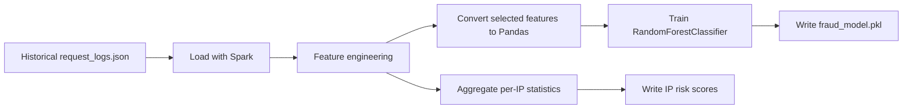

# Spark Analytics

## Purpose

`spark_service/spark_training.py` provides the batch analytics side of the
system. It is responsible for processing historical request logs, deriving
aggregate risk signals, and training an offline fraud model.

## Why Spark Exists In This Architecture

Real-time systems are optimized for fast decisions. Fraud programs also need a
historical layer that can look across larger datasets, compute long-horizon
patterns, and retrain models. Spark fills that role in the current design.

## Current Entry Point

- File: `spark_service/spark_training.py`
- Input path: `spark_service/data/request_logs.json`
- Output paths:
  - `spark_service/output/ip_risk_scores.json`
  - `spark_service/output/fraud_model.pkl`

## Current Processing Flow

## Current Implemented Steps

The batch job currently:

1. Starts a local Spark session.
2. Loads request logs from JSON.
3. Lowercases prompt text.
4. Extracts scam-keyword matches with a regex.
5. Builds a label from `fraud_verdict == "fraud"`.
6. Aggregates request counts by `metadata.client.ip_hash`.
7. Writes per-IP aggregate output.
8. Converts selected features to Pandas.
9. Trains a `RandomForestClassifier`.
10. Saves the trained model as a pickle file.

## Current Features In Use

| Feature | Meaning |
| --- | --- |
| `contains_scam` | Whether prompt text matches known suspicious phrases |
| `asn` | Autonomous System Number as a network-level signal |
| `device_type` | Available in extracted data, useful for future modeling |
| `label` | Fraud label derived from historical verdicts |

## Current Role In The Larger System

Spark is not intended to replace the real-time fraud path. Instead, it provides:

- historical aggregation
- offline model training
- risk-score generation
- future feature calibration for streaming rules

## Batch Plus Stream Relationship

This project follows a hybrid architecture:

- Flink handles low-latency decisions
- Spark learns from accumulated data

That relationship should be preserved because it reflects common industry
patterns in fraud detection platforms.

## Current Dataset Note

The file `spark_service/data/request_logs.json` currently exists as the initial
dataset location for batch training. It serves as the expected handoff point for
future log export and synthetic-data workflows.

## Future Analytics Directions

| Area | Direction |
| --- | --- |
| Aggregations | Publisher, ASN, device, prompt-family, and session risk rollups |
| Labels | Stronger coordinator-based labels from multiple fraud signals |
| Feature store style output | Persist reusable batch features for streaming enrichment |
| Retraining cadence | Periodic local or scheduled model retraining |

## Why Historical Aggregation Matters

Some fraud patterns are only visible over time:

- slowly increasing abusive traffic from one network range
- suspicious reuse of prompt templates across many sessions
- changing device or ASN distributions for one source
- traffic spikes that do not look suspicious in a single request

## Engineering Direction

Future work should continue to enrich the current Spark pipeline rather than
replace it. The existing file already defines the intended training boundary:
historical logs in, features out, model artifact saved.
