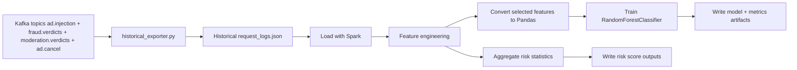

# Spark Analytics

## Purpose

`spark_service/historical_exporter.py` and `spark_service/spark_training.py`
provide the batch analytics side of the system. Together they are responsible
for building historical request logs from Kafka topics, deriving aggregate risk
signals, and training an offline fraud model.

## Why Spark Exists In This Architecture

Real-time systems are optimized for fast decisions. Fraud programs also need a
historical layer that can look across larger datasets, compute long-horizon
patterns, and retrain models. Spark fills that role in the current design.

## Current Entry Points

- Exporter: `spark_service/historical_exporter.py`
- Trainer: `spark_service/spark_training.py`
- Input path: `spark_service/data/request_logs.json`
- Output paths:
  - `spark_service/output/ip_risk_scores.json`
  - `spark_service/output/publisher_risk_scores.json`
  - `spark_service/output/asn_risk_scores.json`
  - `spark_service/output/session_risk_scores.json`
  - `spark_service/output/fraud_model.pkl`
  - `spark_service/output/model_metrics.json`
  - `spark_service/output/feature_columns.json`

## Current Processing Flow

## Current Implemented Steps

The batch pipeline currently:

1. Consumes Kafka events and builds joined historical rows by `req_id`.
2. Appends JSONL training rows to `spark_service/data/request_logs.json`.
3. Starts a local Spark session.
4. Loads historical logs from JSONL.
5. Normalizes request and verdict fields into a training dataframe.
6. Lowercases prompt text and extracts scam-keyword matches with a regex.
7. Builds labels from exported `final_label` values.
8. Aggregates per-IP, per-publisher, per-ASN, and per-session risk statistics.
9. Converts selected features to Pandas.
10. Trains a `RandomForestClassifier` when dataset size and class balance are sufficient.
11. Saves model plus training metrics artifacts.

## Current Features In Use

| Feature | Meaning |
| --- | --- |
| `contains_scam` | Whether prompt text matches known suspicious phrases |
| `asn` | Autonomous System Number as a network-level signal (from `optional_context.asn`) |
| `publisher_id` | Traffic source identifier, useful for future modeling |
| `shallow_fraud_score` | Prior shallow-stage risk score used as a model feature |
| `label` | Fraud label derived from historical combined verdicts (`final_label`) |

## Current Role In The Larger System

Spark is not intended to replace the real-time fraud path. Instead, it provides:

- historical aggregation
- offline model training
- risk-score generation
- future feature calibration for streaming rules

## Batch Plus Stream Relationship

This project follows a hybrid architecture:

- Flink handles low-latency decisions
- Spark learns from accumulated data

That relationship should be preserved because it reflects common industry
patterns in fraud detection platforms.

## Current Dataset Note

The file `spark_service/data/request_logs.json` is the dataset handoff point for
batch training and is now populated by `spark_service/historical_exporter.py`.

## Future Analytics Directions

| Area | Direction |
| --- | --- |
| Aggregations | Publisher, ASN, device, prompt-family, and session risk rollups |
| Labels | Stronger coordinator-based labels from multiple fraud signals |
| Feature store style output | Persist reusable batch features for streaming enrichment |
| Retraining cadence | Periodic local or scheduled model retraining |

## Why Historical Aggregation Matters

Some fraud patterns are only visible over time:

- slowly increasing abusive traffic from one network range
- suspicious reuse of prompt templates across many sessions
- changing device or ASN distributions for one source
- traffic spikes that do not look suspicious in a single request

## Engineering Direction

Future work should continue to enrich the current Spark pipeline rather than
replace it. The existing file already defines the intended training boundary:
historical logs in, features out, model artifact saved.
